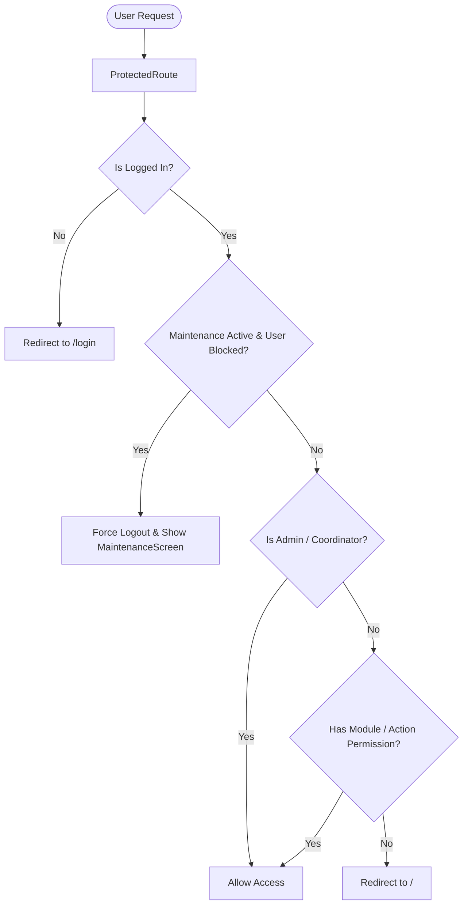
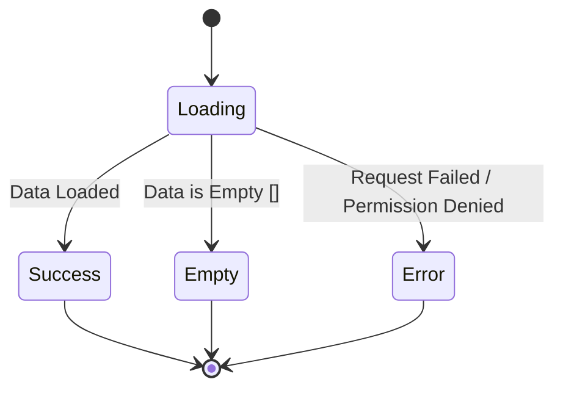
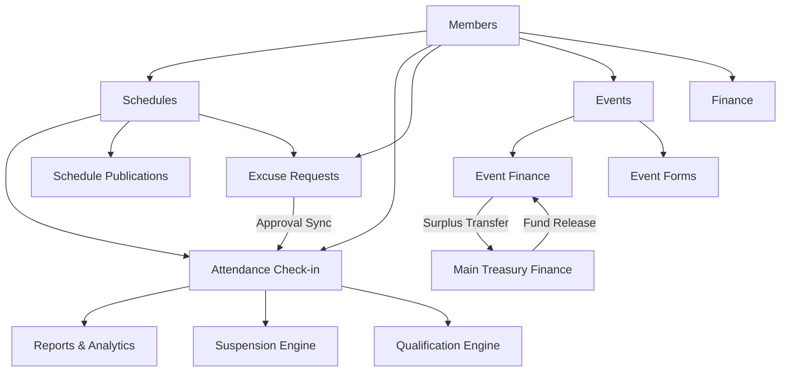

# AI DEVELOPMENT RULES

> **Document Type:** Mandatory AI Development Constitution & Operational Rules  
> **Target Project:** MATS (Ministry Attendance Tracking System / Ministry Administration & Tracking System)  
> **Source of Truth:** [`PROJECT_DISCOVERY.md`](file:///C:/Users/kyle/Desktop/MATS/PROJECT_DISCOVERY.md)  
> **Authority:** Permanent & Non-Negotiable for all AI Coding Agents.

---

## 1. Purpose and Authority

This document is the **primary set of development rules and constitutional boundaries** for any AI coding assistant or autonomous agent operating in the MATS repository.

All AI agents working on this codebase must adhere strictly to these principles:
* **Understand Before Changing:** Thoroughly inspect the existing implementation, type definitions, and services before modifying code.
* **Preserve Architecture:** Preserve the established Feature-Sliced directory structure, singleton service abstraction, and React Query caching layer.
* **Reuse Over Reinventing:** Always reuse existing shared components, hooks, services, and utilities.
* **Smallest Safe Change:** Make the smallest reasonable change required to fulfill the user's prompt.
* **No Unnecessary Refactoring:** Avoid refactoring working files, renaming symbols, or reorganizing modules unless explicitly commanded by the user.
* **Zero Duplicate Patterns:** Never introduce competing UI primitives, duplicate services, or divergent data models.
* **Security Is Non-Negotiable:** Never sacrifice security, role authorization, or data boundaries for implementation convenience.
* **Visuals Do Not Equal Correctness:** Never assume that because a UI appears functional in the browser, the underlying data flow, Firestore batching, or security rules are correct.
* **Verify Dependencies & Side Effects:** Inspect the full dependency chain (e.g., Schedules → Attendance → Reports → Suspension Policy) before changing upstream models.

### Strict Decision Priority Order
When resolving any implementation trade-off, agents must apply this hierarchy:
1. **Security and Authorization** (Firestore security rules, authentication guards, user permissions)
2. **Existing Business Rules** (Attendance session locking, policy absence thresholds, period locks, sequential tracking numbers)
3. **Data Integrity** (Atomic Firestore transactions, 500-item batch limits, timestamp consistency)
4. **Existing Architecture** (Service layer encapsulation, Feature-Sliced modularity, React Query)
5. **UI/UX Consistency** (V2 Slate/Indigo design language, shared components, semantic status colors)
6. **Maintainability** (TypeScript strict typing, localized change radius, readability)
7. **New Implementation Convenience** (Easiest path for the AI is *always* subordinate to the above)

---

## 2. Mandatory AI Workflow

Every non-trivial task must follow this 9-step workflow sequentially:

```
UNDERSTAND ──► INSPECT ──► IDENTIFY REUSE ──► CHECK DEPENDENCIES ──► CHECK AUTHORIZATION ──► PLAN ──► IMPLEMENT ──► VERIFY ──► REPORT
```

1. **UNDERSTAND:** Read the user request carefully. Distinguish what is explicitly requested from what is out of scope.
2. **INSPECT:** Inspect the actual source code across the entire relevant stack:
   * Related pages (`src/features/*/pages/`)
   * Related components (`src/features/*/components/` and `src/components/`)
   * Related services (`src/services/` and `src/services/finance/`)
   * Types and interfaces (`src/types/`)
   * Hooks and contexts (`src/hooks/`, `src/context/`, `src/features/authentication/`)
   * Firestore queries, batch writes, and transactions
   * Firestore security rules (`firestore.rules`)
   * Route definitions and guards (`src/App.tsx`, `ProtectedRoute.tsx`)
   * Permission gates (`profile.permissions`, `hasModuleAccess`, `canAction`)
   * Downstream and upstream dependent features
3. **IDENTIFY REUSE:** Find existing shared primitives (`Modal.tsx`, `Dialog.tsx`, `Pagination.tsx`, `Loading.tsx`, `MemberCombobox.tsx`, `pdfSignatureHelper.ts`) and existing service methods before authoring new code.
4. **CHECK DEPENDENCIES:** Trace the feature dependency graph to prevent regressions in downstream modules.
5. **CHECK AUTHORIZATION:** Confirm what role/permission is required and ensure both client guards and backend Firestore rules align.
6. **PLAN:** Formulate a targeted, minimal diff plan.
7. **IMPLEMENT:** Write clean, type-safe code using strict TypeScript and Tailwind CSS v4.
8. **VERIFY:** Verify functional correctness, role authorization, responsive layout, type safety, and regression isolation.
9. **REPORT:** Deliver a concise, factual summary covering what was changed, what was reused, security impact, verification steps, and remaining out-of-scope items.

> [!CAUTION]
> **No Premature Coding:** The AI must NEVER immediately start writing code upon receiving a prompt without first inspecting the relevant source files and dependencies.

---

## 3. Existing Architecture Must Be Preserved

The MATS architecture combines a **Feature-Sliced Frontend** with a **Service Layer Abstraction**:

```
src/
├── app/                  # Application initialization
├── assets/               # Static icons and assets
├── components/           # Shared global UI components
├── context/              # App-level contexts (MaintenanceContext, PWAContext, TutorialContext)
├── features/             # Feature-sliced domain modules
├── firebase/             # Firebase configuration and SDK instances
├── hooks/                # Custom React hooks
├── layouts/              # Shell layouts (DashboardLayout)
├── routes/               # Routing configs
├── services/             # Firestore singleton service layer
│   └── finance/          # Dedicated treasury services
├── types/                # Domain TypeScript models
└── utils/                # Pure mathematical, PDF, and formatting utilities
```

### Architectural Preservation Rules
* **Respect Feature Structure:** Keep feature-specific pages, components, and modals within their respective `src/features/<feature_name>/` directories.
* **Service Layer Encapsulation:** All Cloud Firestore calls (`getDocs`, `addDoc`, `updateDoc`, `deleteDoc`, `writeBatch`, `runTransaction`, `onSnapshot`) must live inside `src/services/` (or `src/services/finance/`). Do **not** author raw Firestore SDK queries directly inside page or modal components.
* **No Layer Shifting:** Do not move logic between architectural layers (e.g., from service to component or from utility to hook) without a documented structural reason.
* **No Competing Patterns:** Do not introduce a new architectural pattern when an existing pattern already solves the problem.
* **No New State Libraries:** Do not install or introduce Redux, Zustand, MobX, Jotai, or Recoil. Client state is managed via React Context and standard hooks; server state is managed via TanStack React Query.
* **No Alternative Fetching Abstractions:** Do not introduce Axios, GraphQL, or SWR.
* **Preserve TanStack React Query:** Do not bypass React Query when querying or mutating data in areas where React Query is established.
* **Preserve TypeScript Strictness:** Retain strict mode (`strict: true`, `noImplicitAny: true`).
* **Preserve Path Aliasing:** Always use `@/` for imports resolving to `src/`.
* **Preserve Naming Conventions:** PascalCase for React components/pages; camelCase for services, hooks, and utilities; PascalCase for TypeScript types and interfaces; UPPER_SNAKE_CASE for constants.

---

## 4. Technology Stack Rules

### Approved Tech Stack

| Technology | Role in MATS | Rule |
| :--- | :--- | :--- |
| **React 19** | UI Library | Use React 19 functional components and hooks. |
| **TypeScript 6** | Language | Strict typing; avoid `any`. |
| **Vite 8** | Bundler & Dev Server | Preserve configuration in `vite.config.ts`. |
| **Tailwind CSS v4** | Styling Engine | Use utility classes; import via `@import "tailwindcss";`. |
| **React Router v7** | Client Routing | Declarative routes via `BrowserRouter`, `Routes`, `Route`, `Navigate`. |
| **TanStack React Query v5** | Server State & Cache | Use `useQuery`, `useMutation`, `queryClient`. |
| **Firebase SDK v12** | Auth & Firestore | Modular v12 SDK (`firebase/auth`, `firebase/firestore`). |
| **jsPDF & AutoTable** | Client PDF Generation | Generate landscape and portrait documents with custom tables. |
| **PDF.js (`pdfjs-dist`)** | PDF Text Extraction | Client-side roster parsing (excluded from Vite deps optimization). |
| **Recharts v3** | Data Visualization | Responsive chart rendering in dashboard. |
| **React Joyride v3** | Walkthrough Guide | Interactive onboarding tour with Tagalog localization. |
| **Oxlint** | Linter | Run Oxlint for static analysis checks. |
| **Custom PWA SW** | Offline & PWA | `/sw.js` and `registerSW.ts` for app installation and update prompt. |

### Dependency Governance Rules
* **No Unauthorized Packages:** Do not install or propose new npm packages unless the existing stack genuinely cannot solve the requirement and the user has given explicit approval.
* **No Redundant Libraries:** Never add a package that duplicates existing library capabilities (e.g., do not add `date-fns` or `moment` when standard `Date` / `Intl` utilities are used; do not add `axios` when Firebase SDK / native `fetch` suffices).
* **Verify Before Adding:** Always search `package.json` and existing utility files before seeking external dependencies.

---

## 5. UI/UX Constitution

MATS has a standardized **V2 Slate / Indigo** visual language. All new or modified UI must visually belong to this system.

```
Background: #f8fafc (slate-50)
Surface: #ffffff (white) with border-slate-200/80
Primary Action: bg-indigo-600 hover:bg-indigo-700 text-white rounded-xl font-bold shadow-xs
Destructive Action: bg-rose-600 hover:bg-rose-700 text-white rounded-xl font-bold shadow-xs
Success Action: bg-emerald-600 hover:bg-emerald-700 text-white rounded-xl font-bold shadow-xs
Warning Action: bg-amber-500 hover:bg-amber-600 text-white rounded-xl font-bold shadow-xs
Input Field: bg-slate-50 border-slate-200 rounded-xl px-3.5 py-2.5 text-sm focus:bg-white focus:ring-2 focus:ring-indigo-500/25
Modal Dialog: fixed inset-0 z-[60] bg-slate-900/60 backdrop-blur-md rounded-3xl
Table Container: rounded-2xl border border-slate-200/80 bg-white overflow-hidden
Table Header: uppercase text-[10px] font-black tracking-wider text-slate-400 bg-slate-50/75
```

### Order Theming Standards (Preserve Exact Palette)
When displaying Order-specific data, badges, or cards, use the established palette:
* **Order of San Pedro:** Red theme (`bg-red-50`, `border-red-200`, `text-red-700`, `bg-red-600`)
* **Order of San Juan:** Blue theme (`bg-blue-50`, `border-blue-200`, `text-blue-700`, `bg-blue-600`)
* **Order of San Tiago:** Emerald theme (`bg-emerald-50`, `border-emerald-200`, `text-emerald-700`, `bg-emerald-600`)
* **Order of San Andres:** Amber theme (`bg-amber-50`, `border-amber-200`, `text-amber-700`, `bg-amber-500`)
* **Officers:** Purple theme (`bg-purple-50`, `border-purple-200`, `text-purple-700`, `bg-purple-600`)
* **Squires:** Indigo / Pink theme (`bg-indigo-50`, `border-indigo-200`, `text-indigo-700`, `bg-indigo-600`)

### Prohibited UI Practices
* ❌ Do not introduce arbitrary brand colors outside the defined Slate / Indigo / Order themes.
* ❌ Do not randomly use arbitrary border radii (e.g., `rounded-md` or `rounded-none`); use standard `rounded-xl` for controls and `rounded-2xl` / `rounded-3xl` for cards and modals.
* ❌ Do not create new button styles when V2 Indigo buttons apply.
* ❌ Do not invent custom modal wrappers when `Modal.tsx` and `Dialog.tsx` exist.
* ❌ Do not create raw unstyled HTML tables without the V2 header and container styles.

---

## 6. Shared Component Rules

The following shared components in `src/components/` are the official primitives of MATS:

```
src/components/
├── Card.tsx                         # Surface container with header support
├── Modal.tsx                        # Glassmorphic modal with size variants & ESC support
├── Dialog.tsx                       # Semantic dialogs (AlertModal, ConfirmModal, PasswordConfirmModal)
├── Pagination.tsx                   # Accessible windowed pagination bar
├── Loading.tsx                      # Centered spinner & progress bar
├── MemberCombobox.tsx               # Typeahead member combobox with custom input fallback
├── MemberSearchDropdown.tsx         # Dropdown selector with rank/order/position subtitles
├── FormattedText.tsx                # Preserves line-breaks and formats links
├── OfflineBanner.tsx                # Network status warning bar
├── InstallPWAButton.tsx             # PWA installation prompt trigger
├── PWAUpdatePrompt.tsx              # Toast for service worker updates
├── ErrorBoundary.tsx                # React root error boundary
└── signatures/
    └── DynamicSignatureConfig.tsx   # Multi-column dynamic signatory manager
```

### Rules for Shared Primitives
1. **Reuse First:** Always reuse existing shared components. Do not re-create an inline equivalent.
2. **Backwards Compatibility:** Never change the props API of a shared component in a way that breaks other consumers. Extend props optionally (`propName?: string`).
3. **Modal Rule (MANDATORY):**
   * All new modals and forms must use `src/components/Modal.tsx`.
   * All alerts, destructive confirmations, and password verifications must use `src/components/Dialog.tsx` (`AlertModal`, `ConfirmModal`, `PasswordConfirmModal`).
   * Do **not** write hand-authored `fixed inset-0 z-50` overlay divs inside pages.
4. **Member Selector Rule (MANDATORY):**
   * Use `src/components/MemberCombobox.tsx` for searchable member selection, officer filtering, and custom text fallbacks.
   * Use native `<select>` only for simple, static, short option lists.
   * Do **not** create a third member picker component.

---

## 7. UI Consistency Rules

When multiple implementations of a UI concept exist in the codebase, the AI must use the **dominant pattern** for all new work:

| UI Concept | Dominant Pattern to Use | Legacy Pattern to Avoid |
| :--- | :--- | :--- |
| **Modal / Dialog** | `Modal.tsx` (`z-[60]`, `backdrop-blur-md`, `rounded-3xl`) | Inline page-local fixed overlay divs |
| **Confirmation** | `ConfirmModal` / `PasswordConfirmModal` from `Dialog.tsx` | Custom inline state confirmations / window `confirm()` |
| **Buttons** | V2 Indigo (`rounded-xl`, `bg-indigo-600`, `shadow-xs`) | Legacy Blue (`rounded-lg`, `bg-blue-600`) |
| **Inputs & Textareas** | V2 Slate (`bg-slate-50`, `border-slate-200`, `rounded-xl`, indigo focus) | Legacy Gray (`bg-white`, `border-gray-300`, `rounded-lg`) |
| **Member Selection** | `MemberCombobox.tsx` | Bespoke clickable `div` dropdown lists |
| **Tables** | V2 Slate Table (`rounded-2xl`, uppercase 10px headers, `Pagination.tsx`) | Legacy unbordered tables / unpaginated tables |
| **Feedback Alerts** | `AlertModal` from `Dialog.tsx` | Raw browser `alert()` or ad-hoc inline text |
| **Loading Indicator** | `Loading.tsx` / `DashboardSkeleton` | Raw unstyled spinner SVGs |

> [!NOTE]
> Do not perform broad unsolicited rewrites of legacy UI in working pages unless specifically requested by the user. When touching a specific section, align it with the dominant pattern.

---

## 8. Routing Rules

Routing is centrally defined in [`src/App.tsx`](file:///C:/Users/kyle/Desktop/MATS/src/App.tsx).

### Route Protection Hierarchy
1. **Public Routes:** Wrapped in `PublicRoute` (e.g., `/login`).
2. **Public Self-Service Routes:** Wrapped in `PublicMaintenanceGuard` (e.g., `/public/schedule/:id`, `/public/excuse`, `/public/events/:eventId/forms/:formId`, `/public/forms/:formId`).
3. **Protected Authenticated Routes:** Nested under the `<DashboardLayout />` shell wrapped in `ProtectedRoute`:
   * Module-Gated Routes: `<ProtectedRoute moduleKey="members">`, `moduleKey="schedules"`, `moduleKey="attendance"`, `moduleKey="reports"`, `moduleKey="events"`, `moduleKey="inventory"`, `moduleKey="excuses"`.
   * Permission-Gated Routes: `<ProtectedRoute moduleKey="finance" requiredPermission="canViewFinanceDashboard">`.
   * Admin-Only Routes: `<ProtectedRoute adminOnly>`.

### Rules for Route Modifications
* ❌ Never create duplicate routes.
* ❌ Never remove `ProtectedRoute`, `moduleKey`, or `adminOnly` props to bypass access errors.
* ❌ Never expose an authenticated administrative page through a `/public/*` route.
* ❌ Never make a public route authenticated if it is intended for parish servers without logins.
* ❌ Always maintain the fallback redirect: `<Route path="*" element={<Navigate to="/" replace />} />`.

---

## 9. Authentication and Authorization (CRITICAL)

MATS enforces role-based and granular permission-based security across frontend guards and backend Firestore rules.



### Authorization Boundaries
1. **Superadmin Scope:** Users with `role: 'admin'` or `role: 'coordinator'` have global, unrestricted access.
2. **Order Leader Scope:** Users with `role: 'order_leader'` have access scoped to their `assignedOrder` (e.g., *Order of San Pedro*). Data must be filtered accordingly.
3. **Granular Action Permissions:** Users with `role: 'user'` must have explicit boolean flags set in `profile.permissions` (e.g., `canTakeAttendance`, `canAddIncome`, `canCreateFundRequest`, `canManageEvents`, `canManageInventory`).

### Strict Authorization Rules
* ❌ **Frontend Is Not the Final Security Boundary:** Hiding a UI button does not make an operation secure. Firestore rules must always enforce the restriction.
* ❌ **Never Bypass Permission Helpers:** Never bypass `hasModuleAccess()`, `canAction()`, or `isSuperAdmin()`.
* ❌ **Never Grant Permissions as a Shortcut:** Never elevate a user's role or grant extra permission flags in code to silence a permission error.
* ❌ **Never Convert Protected Logic to Public Logic:** If an operation fails with `permission-denied`, investigate the user role and Firestore rule—never make the endpoint unauthenticated.

---

## 10. Firestore Rules and Database Security

`firestore.rules` is the security enforcement engine of MATS.

### High-Risk Security Rules Boundaries
* **Immutable User Fields:** Regular users cannot modify `role`, `permissions`, `assignedOrder`, or `presetName` on their own user document.
* **Append-Only Audit Logs:** `auditLogs` collection permits `allow create: if true;` but strictly enforces `allow update, delete: if false;`.
* **Period-Locked Treasury:** Financial operations must verify that the target `financePeriods` document is not closed.
* **Attendance Status Enum:** Firestore rules strictly enforce valid attendance statuses: `['present', 'late', 'absent', 'excused', 'observer', 'formation', 'alumni']`.

### Rules for Firestore Security Rules
* 🚨 **NEVER weaken security rules to make an operation succeed.**
* 🚨 **NEVER add `allow read, write: if true;` to an internal or administrative collection.**
* 🚨 **NEVER alter `isSuperAdmin()`, `hasPermission()`, or `hasModuleAccess()` logic without explicit human confirmation.**
* When investigating a `FirebaseError: Missing or insufficient permissions`:
  1. Inspect the authenticated user's `uid`, `role`, and `permissions`.
  2. Inspect the exact Firestore path and payload being written.
  3. Inspect the matching rule block in `firestore.rules`.
  4. Fix the application query or payload structure rather than opening the rule.

---

## 11. Public Data Rules

MATS operates public self-service portals (`/public/schedule/:id`, `/public/excuse`, `/public/events/...`, `/public/forms/...`).

### Rules for Public Endpoints
* **Minimum Data Exposure:** Public queries must retrieve only fields strictly necessary for self-service functionality.
* **Protect Private Member Data:** Never include sensitive personal member fields (such as `homeAddress`, `phoneNumber`, `dateOfBirth`) in public payloads or public search dropdowns.
* **Narrow Public Writes:** Public write permissions must be strictly scoped (e.g., updating only `assignedMembers` in schedules or appending new documents in `excuseRequests` and `eventFormResponses`).
* **Guard by Maintenance Mode:** All public routes must remain wrapped in `PublicMaintenanceGuard` to shut down public data access during system maintenance.

---

## 12. Service Layer Rules

All business logic and Cloud Firestore operations must reside in dedicated singleton services under `src/services/` and `src/services/finance/`.

### Rules for Services
1. **Reuse Existing Methods:** Check the relevant service before authoring a new Firestore query.
2. **Never Author Raw Firestore Calls in Components:** Components must call `memberService.addMember(...)`, `scheduleService.getSchedules(...)`, etc.
3. **Preserve Batching Safety:** When performing multi-document writes, respect Firestore's 500-operation batch limit. Chunk operations in batches of 500 (see `attendanceService.saveAttendanceRecords`).
4. **Preserve Server Timestamps:** Always use `serverTimestamp()` for `createdAt` and `updatedAt`.
5. **Preserve Input Sanitization:** Deeply strip `undefined` values before sending objects to Firestore (see `cleanFirestoreData` in `eventFinanceService.ts` and `inventoryService.ts`).

---

## 13. React Query Rules

TanStack React Query (`@tanstack/react-query`) is the standard server-state and caching mechanism.

### React Query Rules
* **Consistent Query Keys:** Use structured array keys matching the domain (e.g., `['members', includeArchived]`, `['schedules', startDate, endDate]`, `['finance', 'summary', periodId]`).
* **Cache Invalidation on Mutation:** Invalidate related query keys after successful mutations (`queryClient.invalidateQueries({ queryKey: [...] })`).
* **No Duplicate Server State:** Do not copy React Query data permanently into unrelated `useState` containers unless editing a local draft.
* **Respect Default Configuration:** The global `staleTime` is set to 5 minutes (`1000 * 60 * 5`) with 1 retry.

---

## 14. Data Integrity Rules

Never compromise data consistency for implementation speed:
* **Atomic Sequential Counters:** Reference numbers (e.g., excuse tracking numbers `EX-YYYYMM-XXXXX`, finance voucher references) must be generated using `runTransaction` against the `counters` collection. Never calculate sequence numbers via client-side array lengths.
* **Soft Deletes / Archiving:** Collections with archiving support (`members`, `financeIncome`, `financeExpenses`, `events`, `inventory_items`) use `isArchived: boolean`, `archivedAt`, and `archivedByUid`. Preserve soft-delete semantics rather than calling `deleteDoc` unless permanent deletion is explicitly requested.
* **Relational Foreign Keys:** Always preserve foreign key references (`memberId`, `scheduleId`, `sessionId`, `eventId`, `periodId`, `categoryId`, `purposeId`).

---

## 15. Attendance Rules (HIGH CRITICALITY)

Attendance is the core compliance and governance engine of the ministry.

```
Allowed Statuses: 'present' | 'late' | 'absent' | 'excused' | 'observer' | 'formation' | 'alumni'
```

### Mandatory Attendance Rules
* 🔒 **Session Locking:** An attendance session that has `locked: true` must **never** be modified. Attempts to save records against a locked session must throw an error.
* 🔒 **Password Verification on Unlock:** Unlocking a locked attendance session requires re-authenticating the administrator/coordinator password. Never remove or bypass this prompt.
* 📊 **Absence Calculation Integrity:** Absence evaluation logic in `reportService.ts` and `suspensionLifecycleService.ts` determines member suspensions. Do not modify absence filtering without testing against the suspension policy rules.
* 📝 **Audit Trail:** Locking and unlocking sessions must always record `ATTENDANCE_LOCK` and `ATTENDANCE_UNLOCK` events in `auditLogs`.

---

## 16. Schedule Rules

Schedules directly feed attendance tracking, public sign-ups, and reports.

### Mandatory Schedule Rules
* **Conflict Prevention:** Always run `isTimeOverlapping` validation to prevent double-booking servers across concurrent mass slots.
* **Public Constraints:** Public self-service sign-up must enforce maximum limits defined in `schedulePublications` (`maxSundaysPerServer`, `maxWeekdaysPerServer`, `allowedRanks`).
* **Chronological Sorting:** All schedule queries must be sorted chronologically by `date` (YYYY-MM-DD) and `startTime` (HH:MM).
* **Cascade Awareness:** Deleting or modifying a schedule affects `attendanceSessions`, `attendance`, `excuseRequests`, and reports.

---

## 17. Excuse System Rules

The excuse system bridges public member submissions and live attendance records.

### Mandatory Excuse Rules
* **Tracking Number Format:** Must maintain `EX-YYYYMM-XXXXX` generated atomically via `counters/excuses`.
* **Automatic Attendance Synchronization:** Approving an excuse request in `excuseService.approveExcuseRequest` must automatically update the corresponding `attendance` records for that member and schedule to `status: 'excused'`.
* **Rejection Reason Required:** Rejecting an excuse request requires a descriptive `rejectionReason`.
* **Public Status Isolation:** Public users check excuse status via `excuseStatus/{trackingNumber}` without gaining read access to private administrative notes.

---

## 18. Finance & Treasury Rules (HIGH RISK)

Finance is a high-risk financial accounting subsystem.

### Mandatory Finance Rules
* 🚫 **Strict Period Locking:** Financial periods (`financePeriods/YYYY-MM`) with `status: 'closed'` are locked. The AI must **never** allow adding, updating, or deleting income, expenses, or requisitions in a closed period.
* 💰 **Approval Workflow Integrity:** Requisitions must strictly traverse the lifecycle: `draft` → `pending` → `approved` → `released` → `liquidated` → `closed`. Do not allow releasing funds without prior approval.
* 🧾 **Liquidation Reconciliation:** Liquidations must account for the full released amount through itemized expenses (`liquidationExpenses`), returned cash (`returnedAmount`), or reimbursements (`reimbursedAmount`).
* 🔄 **Event-to-Main Treasury Transfers:** Surplus transfers from events must write to `eventFundTransfers` and create a corresponding `financeIncome` document with `sourceType: 'event_transfer'`.
* 🛡️ **Audit Logging:** Every financial mutation must generate structured audit logs (`INCOME_ADD`, `EXPENSE_RECORD`, `REQUEST_APPROVE`, `FUNDS_RELEASE`, `LIQUIDATION_APPROVE`, `PERIOD_CLOSE`).

---

## 19. Events and Event Forms Rules

The Events module manages complex workspaces, Kanban boards, and public forms.

### Mandatory Event Rules
* **Stage Lifecycle:** Events traverse stages: `Planning` → `Preparation` → `Ready` → `Ongoing` → `Completed` (or `Cancelled`).
* **Dynamic Form Types:** Form builder supports 14 exact question types (`short_text`, `long_text`, `multiple_choice`, `dropdown`, `checkbox`, `yes_no`, `number`, `date`, `time`, `name_selector`, `member_selector`, `relationship_selector`, `companion_repeater`, `section_header`). Do not alter type keys.
* **Option Capacity Enforcement:** Dynamic form submissions must check and decrement `optionLimits` atomically to prevent over-registration.
* **Sequential Form Tracking:** Form responses must generate tracking numbers via atomic transactions on `counters`.

---

## 20. Inventory Rules

Inventory tracks sacristy assets, vestments, and liturgical equipment.

### Mandatory Inventory Rules
* **Realtime Synchronization:** `inventoryService.subscribeItems` uses Firestore `onSnapshot`. Real-time subscriptions must be cleaned up on component unmount (`useEffect` return cleanup).
* **Condition & Stock Enums:** Conditions must use `'Brand New' | 'Good' | 'Fair / Usable' | 'Damaged / For Repair'`. Stock statuses must use `'In Stock' | 'Low Stock' | 'Out of Stock' | 'Under Maintenance'`.
* **Soft Delete:** Archive items using `isArchived: true` rather than hard deleting.

---

## 21. Audit Log Rules

`auditLogs` is an immutable, append-only chronological log.

### Mandatory Audit Rules
* ❌ **Never Update or Delete Audit Logs:** `firestore.rules` blocks all updates and deletes on `auditLogs`. No AI agent may attempt to alter or purge this collection.
* ✅ **Log Sensitive Operations:** All administrative mutations (member additions, schedule edits, attendance locking, user permission updates, finance approvals, setting updates) must call `auditService.logAction(...)`.
* **Standard Categories:** Use valid categories: `'member' | 'schedule' | 'attendance' | 'settings' | 'system' | 'excuse' | 'finance' | 'events'`.

---

## 22. Loading, Empty, Error, and Success States

Every user-facing asynchronous interaction must handle all 5 states:



1. **Loading State:** Render `src/components/Loading.tsx` for components, or skeleton loaders (`DashboardSkeleton`, `LoginSkeleton`) for full-page mounts.
2. **Empty State:** Display an empty-state container with an icon, title, descriptive message, and an action button where appropriate.
3. **Error State:** Display clear, friendly error messages. For blocking failures, use `AlertModal` (`variant="error"`). Never leave the user with an unhandled white screen.
4. **Success State:** Provide feedback via status badges or `AlertModal` (`variant="success"`), and close the modal automatically on completion.
5. **Offline State:** Respect `src/components/OfflineBanner.tsx` and PWA context when network is disconnected.

---

## 23. PDF, CSV, and Export Rules

MATS generates official parish documents using `jspdf` and `jspdf-autotable`.

### Mandatory Export Rules
* **Centralized Signatures:** Always use [`src/utils/pdfSignatureHelper.ts`](file:///C:/Users/kyle/Desktop/MATS/src/utils/pdfSignatureHelper.ts) (`drawSignatures`, `calculateSignatureBlockHeight`) to render signatory blocks. Do not hardcode custom coordinate math.
* **Parish Header Integrity:** Maintain official headers (*Sacred Heart of Jesus Parish – MBS*, *Ministry of Altar Servers*) and official logos.
* **Data Boundary Adherence:** Exported PDFs and CSVs must respect user permissions and role scopes (e.g., an Order Leader's PDF export must only contain members from their assigned order).
* **Landscape Orientation for Matrices:** Use landscape orientation for complex attendance and qualification tables.

---

## 24. Performance Rules

* ⚡ **Avoid Redundant Firestore Listeners:** Use standard `getDocs` queries for static page loads. Use `onSnapshot` only where real-time synchronization is required (e.g., Inventory, Auth profile, Maintenance mode).
* ⚡ **Always Clean Up Subscriptions:** Any `onSnapshot` listener created inside a `useEffect` must return an unsubscribe cleanup function.
* ⚡ **Paginate Large Collections:** Tables displaying more than 10–15 items must use `src/components/Pagination.tsx`.
* ⚡ **Memoize Expensive Calculations:** Use `useMemo` for heavy report calculations, filtering, and sorting.

---

## 25. Large File Rules

The MATS codebase contains several large, high-complexity files:
* [`src/features/finance/pages/FinancePage.tsx`](file:///C:/Users/kyle/Desktop/MATS/src/features/finance/pages/FinancePage.tsx) (>4,000 lines)
* [`src/features/users/pages/UsersPage.tsx`](file:///C:/Users/kyle/Desktop/MATS/src/features/users/pages/UsersPage.tsx) (>2,500 lines)
* [`src/features/events/pages/PublicEventFormPage.tsx`](file:///C:/Users/kyle/Desktop/MATS/src/features/events/pages/PublicEventFormPage.tsx)
* [`src/features/events/components/EventFormBuilderModal.tsx`](file:///C:/Users/kyle/Desktop/MATS/src/features/events/components/EventFormBuilderModal.tsx)

### Rules for Large Files
* **Do Not Bloat:** When adding a new capability to a large file, extract the new sub-view or modal into a separate file under `src/features/<module>/components/`.
* **No Unsolicited Refactoring:** Do not attempt a full rewrite or split of `FinancePage.tsx` or `UsersPage.tsx` unless the user explicitly commands a refactoring task.
* **Precise Local Edits:** Make surgical, targeted edits within the specific workflow requested.

---

## 26. Duplicate and Legacy Pattern Rules

### Rules for Handling Known Duplicates
1. **Never Add New Duplicates:** Do not introduce another modal wrapper, member dropdown, or button style.
2. **Use Dominant Patterns:** Always use the dominant V2 Slate/Indigo pattern for new work.
3. **Do Not Silently Delete Legacy Code:** If a legacy helper exists, leave it in place if other features depend on it. Do not perform sweeping migrations without user consent.

---

## 27. Dashboard and Mock Data Rules

* ⚠️ **Identify Mock Data:** Note that `DashboardCharts.tsx` currently contains mock datasets for "Group Performance" and "Attendance Trend".
* ⚠️ **Do Not Falsify Metrics:** When modifying dashboard logic, clearly distinguish between live Firestore aggregations (active members, today's schedules, celebrants) and static chart placeholders.
* ⚠️ **Live Migration Requirement:** If the user requests making dashboard charts dynamic, calculate metrics from `reportService.loadReportData` rather than inventing synthetic numbers.

---

## 28. Code Quality and TypeScript Rules

* **Strict TypeScript:** No implicit `any`. All function parameters, return values, and state hooks must have explicit or properly inferred types.
* **No Broken Linting:** Code must pass `oxlint` with zero errors.
* **Descriptive Naming:** Avoid single-letter variables except for standard loop indices (`i`, `idx`).
* **Defensive Null Checks:** Guard against missing Firestore fields using optional chaining (`data?.field || ''`).
* **Preserve Existing Comments:** Do not delete existing architectural or explanatory comments.

---

## 29. Change Scope Rules

AI agents must strictly respect the user's requested scope.

```
USER ASKS FOR FEATURE X:
├── IMPLEMENT: Feature X using existing services and components
├── VERIFY: Feature X works without breaking dependencies
└── DO NOT: Redesign Feature Y, refactor File Z, or modify Firestore rules
```

> [!IMPORTANT]
> **Prefer the Smallest Safe Change over the Largest Cleanup Possible.**

---

## 30. Security-Sensitive Changes Requiring Explicit Approval

An AI agent **MUST NOT** independently execute any of the following changes without presenting a risk explanation and waiting for explicit user confirmation:

1. Modifying `firestore.rules`.
2. Changing `AuthContext.tsx` login, logout, or persistence logic.
3. Modifying `isSuperAdmin()`, `hasModuleAccess()`, or `canAction()` authorization logic.
4. Changing the role hierarchy (`admin`, `coordinator`, `order_leader`, `user`).
5. Altering attendance session locking or password verification requirements.
6. Altering financial period closure (`financePeriods`) rules.
7. Changing financial requisition approval, release, or liquidation workflows.
8. Altering atomic sequence counter transactions on `counters`.
9. Modifying public route data exposures.
10. Modifying `auditLogs` structure or permissions.

### Required Escalation Format
If a security-sensitive change is required, the AI must output:
```markdown
> [!WARNING]
> **SECURITY-SENSITIVE CHANGE DETECTED**
> * **Action:** [What needs to change]
> * **Reason:** [Why it is necessary]
> * **Affected Files:** [List of files]
> * **Security Impact:** [What authorization/data boundary is affected]
> * **Risk Assessment:** [Potential risks]
> 
> *Awaiting your explicit confirmation before proceeding.*
```

---

## 31. Pre-Modification Checklist

Before modifying any existing code, the AI must internally verify:
* [ ] Does an existing shared component solve this? (`Modal.tsx`, `Dialog.tsx`, `MemberCombobox.tsx`)
* [ ] Does an existing service method already perform this query/mutation?
* [ ] What downstream features depend on this data model? (Check Section 32)
* [ ] What user permissions guard this action?
* [ ] What Firestore security rules apply to this collection?
* [ ] Does this operation require atomic transaction safety on `counters`?
* [ ] Does this operation respect financial period locks or attendance session locks?
* [ ] Does this operation require an audit log entry in `auditLogs`?

---

## 32. Feature Dependency Map



* **Modifying Members:** Directly impacts Schedules, Attendance check-in, Excuses, Event assignments, and Treasury requisitions.
* **Modifying Schedules:** Directly impacts Attendance sessions, Public sign-up, and Missed schedule excuse dropdowns.
* **Modifying Attendance Records:** Directly impacts Reports, Absence counts, Suspensions, and Qualifications.
* **Modifying Excuse Approvals:** Directly synchronizes with Attendance records (`status: 'excused'`).
* **Modifying Event Finance:** Directly links to Main Treasury (`financeIncome` transfers, `financeExpenses`).

---

## 33. Verification Rules

After implementing any code change, the AI must verify:

### 1. Functional Verification
* Does the new/modified feature perform its exact intended function?
* Do existing features in the same module continue to work without regression?
* Are all 5 UI states (loading, empty, error, success, offline) properly handled?

### 2. Authorization & Security Verification
* Can authorized roles (`admin`, `coordinator`, permitted `user`) perform the action?
* Are unauthorized roles properly blocked?
* Are public routes strictly limited to non-sensitive fields?

### 3. Data Integrity Verification
* Are Firestore documents written with correct schemas and server timestamps?
* Are 500-item batch limits respected?
* Are counters and reference numbers updated within atomic transactions?

### 4. UI/UX Verification
* Does the UI strictly conform to the V2 Slate/Indigo visual tokens?
* Are shared components (`Modal`, `Dialog`, `Pagination`, `MemberCombobox`) utilized?
* Is the layout fully responsive on mobile screens?

### 5. Code Quality Verification
* Does `tsc -b` pass without TypeScript errors?
* Does `oxlint` pass without linter errors?
* Are there any dead imports or unused variables?

---

## 34. Definition of Done

A task is **COMPLETE** only when ALL of the following criteria are satisfied:
* [x] Requested functionality is fully implemented.
* [x] Existing functionality and architecture are preserved.
* [x] Authorization gates and security boundaries are intact.
* [x] UI follows the V2 Slate/Indigo design tokens.
* [x] Existing shared components and services were reused.
* [x] Related dependencies were checked and unaffected by regressions.
* [x] All 5 UI states (loading, empty, error, success, offline) are handled.
* [x] TypeScript strict compilation passes with zero errors.
* [x] Oxlint passes with zero errors.
* [x] No unrelated files were modified or refactored.
* [x] No Firestore security rules were weakened.
* [x] No business rule was silently altered.

---

## 35. NEVER DO THESE (Absolute Prohibitions)

* 🚫 **NEVER** weaken Firestore security rules to resolve a client error.
* 🚫 **NEVER** bypass `AuthContext`, `ProtectedRoute`, `hasModuleAccess`, or `canAction`.
* 🚫 **NEVER** expose private member details (addresses, phone numbers) through public routes.
* 🚫 **NEVER** create duplicate shared components or duplicate Firestore services.
* 🚫 **NEVER** author raw Firestore SDK queries inside React components.
* 🚫 **NEVER** silently alter attendance absence, warning, or suspension calculation formulas.
* 🚫 **NEVER** bypass attendance session locks or password unlock prompts.
* 🚫 **NEVER** allow mutations on closed financial periods (`financePeriods`).
* 🚫 **NEVER** modify or delete records in the `auditLogs` collection.
* 🚫 **NEVER** calculate sequence reference numbers without an atomic transaction on `counters`.
* 🚫 **NEVER** install new npm dependencies without explicit user consent.
* 🚫 **NEVER** refactor or redesign unrelated pages during a feature task.
* 🚫 **NEVER** assume frontend validation replaces backend database rules.
* 🚫 **NEVER** delete existing working code merely because an alternative implementation seems cleaner.

---

## 36. AI Response Requirements

Upon completing any development task in this repository, the AI must output a structured, factual report:

```markdown
### 1. Changed Files
* List of modified files with concise bullet points explaining what was added or updated.

### 2. Reused Primitives & Services
* List of existing shared components, hooks, services, and utilities reused.

### 3. Security & Authorization Status
* Explicit statement confirming that route guards, permissions, Firestore rules, and data boundaries were preserved.

### 4. Verification Performed
* Details of TypeScript type checks, lint checks, error-state handling, and regression verification.

### 5. Known Risks & Considerations
* Any specific operational risks or downstream considerations.

### 6. Out of Scope Items
* Specific tasks or refactors intentionally left untouched to protect project stability.
```

---

## 37. Final Principle

> "Do not make MATS more complicated than it needs to be. Do not make it less secure than it already is. Do not introduce a new pattern when an existing pattern already works. Understand the system first, then make the smallest safe change."

**The AI is an engineer working inside an existing system, not the owner of the architecture. It must preserve the project's established decisions unless the user explicitly authorizes changing them.**
