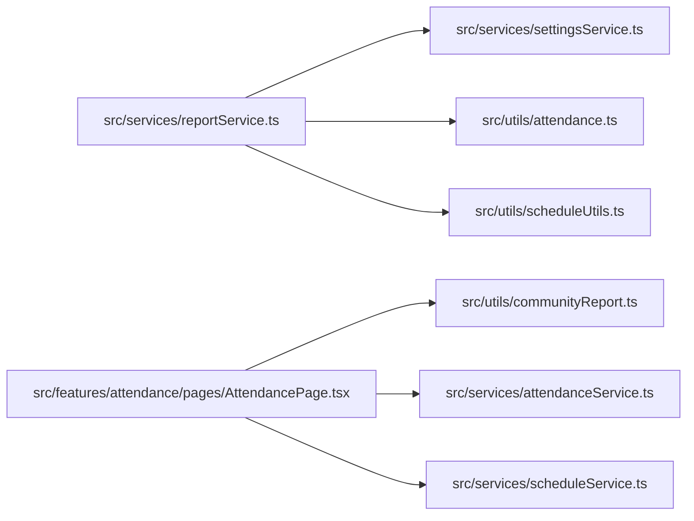

# AI Handoff & Developer Guide

> **Note for AI Assistant**: This document is specifically engineered to provide an incoming AI agent or developer with complete operational knowledge of the MATS (Ministry Attendance Tracking System) codebase. Read this document thoroughly before writing or modifying any code.

---

## 1. Executive Summary & Core Mindset

- **Project Goal**: Digitizes attendance tracking, member roster management, service schedule generation, and performance reporting for church altar server ministries.
- **Architecture Standard**: Feature-Sliced UI Components (`src/features/`) backed by a strict Service Abstraction Layer (`src/services/`).
- **Golden Rule**: **NEVER query or mutate Cloud Firestore directly from React components.** All database interactions MUST go through dedicated methods in `src/services/`.

---

## 2. Crucial Architectural Rules & Decisions

### 1. Service Layer Encapsulation
- All Firestore imports (`collection`, `doc`, `getDocs`, `addDoc`, `updateDoc`, `deleteDoc`, `writeBatch`) must reside inside `src/services/`.
- Do not import `db` from `@/firebase/config` inside React components. Component files should only call service methods (e.g., `memberService.getMembers()`, `scheduleService.assignMembers()`).

### 2. Path Aliases
- Always use the `@/` path alias mapped to `src/` (configured in `vite.config.ts` and `tsconfig.app.json`).
- Example: `import { Member } from '@/types/member'` instead of `import { Member } from '../../types/member'`.

### 3. Git & Mutation Safety
- **USER RULE**: Do NOT execute `git merge` or `git commit` without explicit confirmation from the user.
- Always run `npm run build` and `npm run lint` to verify type safety and linting compliance before finalizing any code edits.

---

## 3. Common Pitfalls & Anti-Patterns to Avoid

| Area | Common Mistake | Correct Pattern |
| :--- | :--- | :--- |
| **Firestore Limits** | Writing batches with > 500 operations. | Chunk write arrays into max 500 items per `writeBatch` (e.g. `BATCH_SIZE_LIMIT = 500` in `memberService.ts`). |
| **Excel CSV Exports** | Exporting plain CSV strings without UTF-8 BOM. | Always prefix generated CSV strings with `\uFEFF` so accents and special characters render cleanly in Excel. |
| **Schedule Overlaps** | Assigning a server to two concurrent services. | Call `isTimeOverlapping(startA, endA, startB, endB)` before persisting duty assignments. |
| **Session Unlocking** | Re-opening locked attendance sessions without password confirmation. | Require password re-authentication via `authService.verifyPassword()` or `reauthenticateWithCredential`. |
| **Secondary App Auth** | Calling `createUserWithEmailAndPassword` on main auth instance (logs out active admin session). | Use secondary Firebase App instance (`SecondaryApp`) in `userService.registerNewUserWithAuth`. |

---

## 4. Tightly Coupled Areas

1. **`reportService.ts` & `settingsService.ts`**: The attendance policy settings (`settings/suspensionPolicy`) dynamically control how absences and lates are calculated in `reportService.generateMemberReport()`.
2. **`AttendancePage.tsx` & `communityReport.ts`**: The Facebook report preview modal depends on form state mapping, member ranks (e.g., Squires identification), and custom template substitution tags.
3. **`recurringService.ts` & `scheduleUtils.ts`**: CSV template extraction relies on Levenshtein distance fuzzy string matching (`getLevenshteinDistance`) and date parsing helpers (`parseFlexibleDate`).

---

## 5. Reusable Components & Utilities Matrix

Prefer reusing existing primitive components and helpers over creating new custom UI:

- **UI Components**:
  - `src/components/Card.tsx`: Standard card container with border and subtle shadows.
  - `src/components/Dialog.tsx`: `AlertModal` and `ConfirmModal` for accessible modal popups.
  - `src/components/Pagination.tsx`: Reusable table pagination footer component.
  - `src/components/OfflineBanner.tsx`: Network status notification banner.
- **Domain Utilities**:
  - `src/utils/member.ts`: `getFullName(member, includeNickname)` for standardized name formatting.
  - `src/utils/scheduleUtils.ts`: `getScheduleStatus(schedule)` and `isSundayOrAnticipatedMass(title, date, time)`.
  - `src/utils/attendance.ts`: `calculateAttendanceSummary()` and `calculateAttendanceRate()`.

---

## 6. Files That Should NOT Be Modified Lightly

1. `firestore.rules`: Security rules for Cloud Firestore database collections. Unverified edits can lock down production data or allow unauthorized writes.
2. `src/features/authentication/AuthContext.tsx`: App-wide authentication state provider and permission evaluator (`hasModuleAccess`, `canAction`).
3. `src/firebase/config.ts`: Firebase App initialization logic reading Vite environment variables.

---

## 7. Naming & Coding Conventions

- **File Naming**:
  - React Components: PascalCase (e.g., `AttendancePage.tsx`, `MemberTable.tsx`).
  - Services: camelCase with `Service` suffix (e.g., `memberService.ts`, `reportService.ts`).
  - Utilities: camelCase (e.g., `scheduleUtils.ts`, `communityReport.ts`).
  - Types: camelCase (e.g., `member.ts`, `auth.ts`).
- **Function/Variable Naming**:
  - Boolean variables: Prefix with `is`, `has`, `can`, or `should` (e.g., `isDirty`, `hasRecords`, `canTakeAttendance`).
  - Status types: String unions (e.g., `export type MemberStatus = 'active' | 'inactive' | 'archived'`).

---

## 8. Current Project Goals & Roadmap

### Active Priorities
1. Maintain robust attendance recording, schedule conflict checks, and accurate PDF/CSV report exports.
2. Maintain strict security alignment across Firestore rules and client permission checks.

### Future Roadmap
1. **Automated Duty Notifications**: Integrate Twilio or Firebase Cloud Messaging (FCM) to send duty reminders to servers prior to scheduled services.
2. **Server Shift Swap Portal**: Build a peer-to-peer duty swap request system allowing servers to request replacements when unavailable.
3. **Enhanced Mobile PWA Push**: Enable native push notifications for upcoming duty assignments and system announcements.
