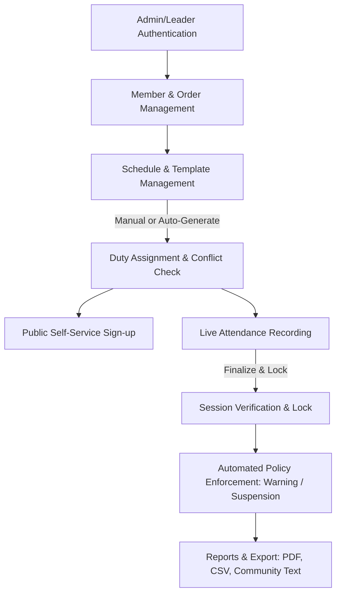
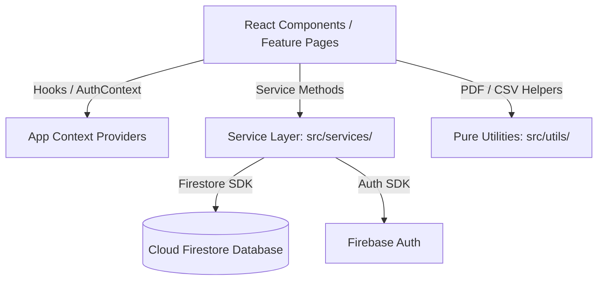
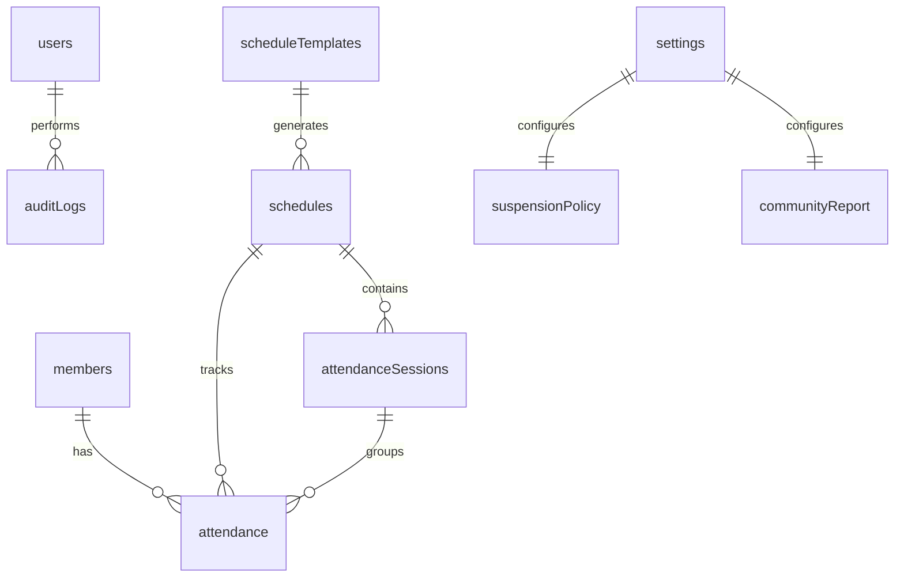

# 1. Project Overview

## Purpose of the System
**MATS (Ministry Attendance Tracking System)** is a full-featured, responsive, production-ready web application built for church ministries (specifically the *Ministry of Altar Servers*). It digitizes and streamlines altar server management, service schedule creation, recurring mass duty generation, live attendance recording, automatic suspension & warning threshold enforcement, and multi-format reporting (PDF, Excel-compatible CSV, and Facebook Community formatted text).

## Target Users
1. **Super Admins & System Administrators**: Full system management, user profile/role creation, settings configuration, attendance policy definitions, and audit log inspection.
2. **Order Leaders / Team Captains**: Group-scoped managers responsible for monitoring attendance and generating reports for specific sub-orders (e.g., Order of San Pedro, San Juan, San Tiago, San Andres, Officers, Squires).
3. **Attendance Takers / Altar Server Officers**: Users who check in servers during services, update attendance statuses, record remarks, and submit finalized attendance sessions.
4. **Altar Servers / General Members**: Access public self-service portals to sign up for duty slots, view schedules, and check their attendance standing.

## Main Workflow


1. **Authentication**: Users log in using Firebase Authentication. Their role and permissions dictate visible modules (`dashboard`, `schedules`, `attendance`, `reports`, `members`, `users`, `settings`, `audit`, `changePassword`).
2. **Member Roster Setup**: Admins maintain server profiles (active, inactive, archived) with ranks (Chevaliers, Paladins, Squires) and Order groups.
3. **Schedule & Template Configuration**: Admins define weekly schedule templates (e.g., Sunday 6:00 AM Mass) or create one-off schedules, bulk import schedules from CSV, or auto-generate monthly schedules.
4. **Member Duty Assignment**: Members are assigned to schedule slots with real-time overlap validation preventing double-booking across concurrent services.
5. **Attendance Check-in & Session Locking**: Attendance takers fill out attendance status (`present`, `late`, `absent`, `excused`, `observer`, `formation`, `alumni`) with optional remarks and additional "Other Servers". Once verified, the session is finalized and locked (unlocking requires password re-authentication).
6. **Policy Evaluation & Reporting**: The system automatically evaluates absences against customizable thresholds (e.g., 2 absences = Warning, 3 = Suspension within evaluation window). Admins/Leaders generate landscape PDF reports, Excel CSV exports, or copy formatted Facebook community announcements.

---

# 2. Tech Stack

- **Core Framework**: React 19 (`react` ^19.2.7, `react-dom` ^19.2.7) with TypeScript (`typescript` ~6.0.2).
- **Build Tool**: Vite (`vite` ^8.1.0) with `@vitejs/plugin-react` (^6.0.2).
- **Styling**: Tailwind CSS v4 (`tailwindcss` ^4.3.1) with `@tailwindcss/vite` (^4.3.1) and custom CSS variables/utilities in `src/index.css`.
- **Routing**: React Router v7 (`react-router-dom` ^7.18.0) utilizing client-side browser routing (`BrowserRouter`, `Routes`, `Route`, `Navigate`).
- **State Management**:
  - **Client State**: Local React hooks (`useState`, `useMemo`, `useEffect`, `useCallback`) and custom context providers (`AuthContext`, `PWAContext`).
  - **Server State / Cache**: TanStack React Query (`@tanstack/react-query` ^5.101.1) for asynchronous queries and caching.
- **Backend & Database**: Firebase v12 (`firebase` ^12.15.0) utilizing:
  - **Firebase Authentication**: Email/password authentication, local session persistence (`browserLocalPersistence`), password re-authentication.
  - **Cloud Firestore**: NoSQL document database, real-time client queries, atomic batched writes (`writeBatch`), server timestamps (`serverTimestamp`).
  - **Firebase Hosting**: Production single-page application (SPA) deployment.
- **Document & Export Utilities**:
  - `jspdf` (^4.2.1) & `jspdf-autotable` (^5.0.8): Client-side landscape PDF generation with custom headers, badges, and colored table styling.
  - `pdfjs-dist` (^4.4.168): Client-side PDF parsing and text extraction for bulk member roster imports.
- **Linting & Quality**: Oxlint (`oxlint` ^1.69.0), TypeScript strict mode (`tsc -b`).

## Folder Structure
```
MATS/
├── public/                 # Static assets (ministy_logo.jpg, manifest.json, sw.js)
├── src/
│   ├── app/                # Application-wide global configs/providers
│   ├── assets/             # Images and SVG icons
│   ├── components/          # Reusable shared UI components (Card, Dialog, Pagination, OfflineBanner, etc.)
│   ├── context/             # App-level state contexts (PWAContext)
│   ├── features/            # Feature-sliced modules (attendance, audit, authentication, dashboard, members, reports, schedules, settings, users)
│   ├── firebase/           # Firebase initialization & config (config.ts)
│   ├── hooks/               # Custom React hooks (usePWA)
│   ├── layouts/            # Page shell layouts (DashboardLayout)
│   ├── lib/                 # Utility libraries
│   ├── routes/              # Routing configurations
│   ├── services/           # Firestore & API abstraction services (auth, member, schedule, attendance, report, settings, user, audit, recurring, dashboard)
│   ├── types/              # TypeScript interface definitions (auth, member, schedule, attendance, audit)
│   └── utils/              # Pure helper functions (attendance, member, scheduleUtils, communityReport, memberPdfReport)
├── docs/                   # Architectural specs, guidelines, task lists, and acceptance reports
├── firestore.rules         # Security & access control rules for Cloud Firestore
├── firebase.json           # Firebase CLI deployment configuration
├── package.json            # Node.js dependencies and build scripts
├── tsconfig.json           # TypeScript configuration
└── vite.config.ts          # Vite build options & path alias definitions (@ -> /src)
```

---

# 3. Application Architecture

## Overall Architecture
MATS follows a **Feature-Sliced Architecture** combined with a dedicated **Service Layer Abstraction**. The UI layer comprises declarative React components, which consume domain logic through singleton service modules (`memberService`, `scheduleService`, `attendanceService`, `reportService`, etc.). All data interactions with Cloud Firestore are encapsulated inside these services.



## Data Flow
1. **User Action**: The user interacts with a feature page (e.g., changing member attendance status in `AttendancePage`).
2. **Local State Update**: UI updates transient state immediately for responsive feedback.
3. **Service Call**: When the user clicks "Save", the page calls `attendanceService.saveAttendanceRecords(...)`.
4. **Validation & Batching**: Service validates inputs, chunks items into 500-operation Firestore batches (`writeBatch`), and writes to Firestore.
5. **Audit Logging**: Successful mutations call `auditService.logAction(...)` to write structured audit records.
6. **State Re-Sync**: UI re-fetches latest server data to align local state with server timestamps.

## Routing & Layout Hierarchy
- `/login` (PublicRoute): Renders `LoginPage`. Redirects to `/` if already authenticated.
- `/public/schedule` (Public): Public self-service signup portal (`PublicSchedulePage`) allowing servers to sign up without logging in.
- `/` (ProtectedRoute + `DashboardLayout`):
  - `/` -> `DashboardOverview` (Accessible to all authenticated roles)
  - `/members` -> `MembersPage` (Requires `members` module access)
  - `/schedules` -> `SchedulesPage` (Requires `schedules` module access)
  - `/attendance` -> `AttendancePage` (Requires `attendance` module access)
  - `/reports` -> `ReportsPage` (Requires `reports` module access)
  - `/change-password` -> `ChangePasswordPage` (Accessible to all authenticated roles)
  - `/users` -> `UsersPage` (Admin-only)
  - `/settings` -> `SettingsPage` (Admin-only)
  - `/audit` -> `AuditPage` (Admin-only)
  - `*` -> Fallback redirect to `/`

---

# 4. Database (Cloud Firestore)

Firestore is structured into 8 top-level collections:



## Collections & Schemas

### 1. `users`
- **Doc ID**: User `uid` (matches Firebase Auth UID).
- **Fields**:
  - `uid` (string, required): Firebase Auth User UID.
  - `email` (string, required): Lowercase normalized email.
  - `displayName` (string, optional): User full name.
  - `role` (string, required): `'admin' | 'user' | 'order_leader'`.
  - `assignedOrder` (string, optional): Order group name for scoped order leaders (e.g., `'Order of San Pedro'`).
  - `presetName` (string, optional): Applied permission preset name.
  - `permissions` (map, optional): Fine-grained module and action permission overrides.
  - `createdAt` (timestamp): Document creation time.
  - `updatedAt` (timestamp): Document update time.

### 2. `members`
- **Doc ID**: Auto-generated string ID.
- **Fields**:
  - `firstName` (string, required): Server first name.
  - `middleName` (string, optional): Server middle name.
  - `lastName` (string, required): Server last name.
  - `suffix` (string, optional): Name suffix (Jr., III, etc.).
  - `nickname` (string, optional): Server nickname.
  - `homeAddress` (string, optional): Address details.
  - `dateOfBirth` (string, optional): `YYYY-MM-DD`.
  - `rank` (string, required): `'Chevaliers' | 'Paladins' | 'Squires'`.
  - `status` (string, required): `'active' | 'inactive' | 'archived'`.
  - `phoneNumber` (string, optional): Contact number.
  - `monthJoined` (string, optional): Month/Year joined.
  - `dateOfInvestiture` (string, optional): Date of investiture.
  - `position` (string, optional): Specific leadership position.
  - `order` (string, optional): Order group name.
  - `createdAt` / `updatedAt` (timestamp).

### 3. `schedules`
- **Doc ID**: Auto-generated string ID.
- **Fields**:
  - `title` (string, required): Mass or meeting title.
  - `date` (string, required): Service date in `YYYY-MM-DD` format.
  - `startTime` (string, required): `HH:MM` (24-hour format).
  - `endTime` (string, required): `HH:MM` (24-hour format).
  - `status` (string, required): `'upcoming' | 'ongoing' | 'completed' | 'cancelled'`.
  - `isLocked` (boolean, optional): Indicates if attendance is finalized & locked.
  - `assignedMembers` (array of strings): Array of member Document IDs.
  - `createdAt` / `updatedAt` (timestamp).

### 4. `attendanceSessions`
- **Doc ID**: Auto-generated string ID.
- **Fields**:
  - `scheduleId` (string, required): Foreign key linking to `schedules` doc ID.
  - `locked` (boolean, required): Whether session is finalized and locked.
  - `hasRecords` (boolean, optional): Indicates if attendance records exist.
  - `finalizedAt` (timestamp | null): Timestamp when session was locked.
  - `finalizedBy` (string | null): User email who locked session.
  - `lastUpdatedBy` (string | null): User email who last saved attendance.
  - `lastUpdatedAt` (timestamp | null): Timestamp of last attendance edit.
  - `createdAt` / `updatedAt` (timestamp).

### 5. `attendance`
- **Doc ID**: Auto-generated string ID.
- **Fields**:
  - `sessionId` (string, required): Linked `attendanceSessions` doc ID.
  - `scheduleId` (string, required): Linked `schedules` doc ID.
  - `memberId` (string, required): Linked `members` doc ID.
  - `status` (string, required): `'present' | 'late' | 'absent' | 'excused' | 'observer' | 'formation' | 'alumni'`.
  - `remarks` (string): Notes/reasons for absence or status.
  - `attendanceDate` (string, required): `YYYY-MM-DD`.
  - `isOtherServer` (boolean, optional): `true` if server was added as an unassigned extra server.
  - `createdAt` / `updatedAt` (timestamp).

### 6. `scheduleTemplates`
- **Doc ID**: Auto-generated string ID.
- **Fields**:
  - `name` (string, required): Template preset name.
  - `title` (string, required): Default schedule title.
  - `dayOfWeek` (string, required): `'Sunday' | 'Monday' | 'Tuesday' | 'Wednesday' | 'Thursday' | 'Friday' | 'Saturday'`.
  - `startTime` / `endTime` (string, required): `HH:MM`.
  - `assignedMembers` (array of strings): Member document IDs.
  - `active` (boolean, required): Active flag for generator inclusion.
  - `createdAt` / `updatedAt` (timestamp).

### 7. `settings`
- **Doc IDs**:
  - `suspensionPolicy`: Contains `warningAbsenceThreshold`, `suspensionAbsenceThreshold`, `evaluationMonths`, `evaluationMonthStr`, `includeSundays`, `includeWeekdays`, `includeMeetings`.
  - `communityReport`: Contains `template` string.
  - `permissionPresets`: Contains `presets` array.

### 8. `auditLogs`
- **Doc ID**: Auto-generated string ID.
- **Fields**:
  - `action` (string, required): Action type enum (`MEMBER_CREATE`, `ATTENDANCE_SAVE`, `USER_LOGIN`, etc.).
  - `category` (string, required): `'member' | 'schedule' | 'attendance' | 'settings' | 'system'`.
  - `description` (string, required): Human-readable log entry.
  - `performedBy` (string, required): User email or UID.
  - `timestamp` (timestamp, required): Action execution time.
  - `details` (map, optional): Additional contextual metadata.

## Required Firestore Composite Indexes
1. `members` | `lastName` (Asc), `firstName` (Asc)
2. `members` | `status` (Asc), `lastName` (Asc), `firstName` (Asc)
3. `schedules` | `date` (Asc), `startTime` (Asc)

---

# 5. Features

## 1. Authentication & Role-Based Access Control (RBAC)
- **Purpose**: Authenticates users and enforces module-level and action-level permissions.
- **User Flow**: User enters email and password on `/login`. `AuthContext` verifies credentials against Firebase Auth and retrieves the corresponding `users` document from Firestore.
- **Pages**: `LoginPage.tsx`, `ChangePasswordPage.tsx`.
- **Components**: `ProtectedRoute`, `PublicRoute`.
- **Firestore Interaction**: Reads `users/{uid}`. Updates `users/{uid}` on password changes. Writes to `auditLogs`.
- **Current Status**: Complete.
- **Known Limitations**: Account registration must be performed by an admin within the portal or initialized in the console. Self-registration is intentionally disabled.

## 2. Member Management
- **Purpose**: Full CRUD management of altar servers with rank tracking, order categorization, and import/export capabilities.
- **User Flow**: Admins view members sorted alphabetically by last name, filter by status (Active vs Archived) or Order group, add/edit member profiles, perform bulk rank updates or bulk archiving, and import roster files (CSV or PDF).
- **Pages**: `MembersPage.tsx`.
- **Components**: `MemberTable.tsx`, `MemberFormModal.tsx`, `MemberImportModal.tsx`, `MemberPDFImportModal.tsx`, `BulkRankEditModal.tsx`.
- **Firestore Interaction**: CRUD operations on `members` collection using sequential batching for imports.
- **Current Status**: Complete.
- **Known Limitations**: PDF parsing uses heuristics to extract names; non-standard PDF formats may require manual column verification.

## 3. Schedule & Template Management
- **Purpose**: Schedule creation, recurring template definition, duty assignments, and bulk schedule generation.
- **User Flow**: Admins view schedules in List or Calendar view. They can create one-off schedules, edit assignments, import schedules via CSV, or launch the Template Manager to auto-generate schedules across a date range.
- **Pages**: `SchedulesPage.tsx`, `PublicSchedulePage.tsx`.
- **Components**: `ScheduleCard.tsx`, `ScheduleFormModal.tsx`, `ScheduleDetailsModal.tsx`, `AssignmentModal.tsx`, `CSVImporterModal.tsx`, `TemplateManagerModal.tsx`, `CalendarView.tsx`.
- **Firestore Interaction**: CRUD operations on `schedules` and `scheduleTemplates`. Validates server double-booking across overlapping time slots.
- **Current Status**: Complete.
- **Known Limitations**: Time comparisons assume same-day bounds; overnight schedules crossing midnight are not supported.

## 4. Attendance Tracking & Session Locking
- **Purpose**: Recording attendance statuses (`present`, `late`, `absent`, `excused`, `observer`, `formation`, `alumni`) for assigned servers and extra servers.
- **User Flow**: Attendance taker navigates to `/attendance?scheduleId=XYZ`, marks statuses, adds "Other Servers", enters optional remarks, and saves. Admins can finalize & lock sessions to prevent further edits. Unlocking requires password re-authentication.
- **Pages**: `AttendancePage.tsx`.
- **Components**: `AttendanceHeader.tsx`, `AttendanceRow.tsx`, `AddOtherServerModal.tsx`, `CommunityReportModal.tsx`, `UnlockSessionModal.tsx`.
- **Firestore Interaction**: Reads/writes `attendanceSessions` and `attendance` records.
- **Current Status**: Complete.
- **Known Limitations**: Session unlock requires active admin account password re-authentication.

## 5. Reports & Analytics
- **Purpose**: Generating comprehensive summaries, calculating attendance rates, evaluating attendance policy violations, and exporting reports.
- **User Flow**: Users navigate to `/reports` to inspect four sub-tabs: *Overall Summary*, *Member Reports*, *Schedule Reports*, and *Monthly Analytics*. Users can apply date range filters, export Excel-compatible CSVs, or download custom-formatted landscape PDFs.
- **Pages**: `ReportsPage.tsx`.
- **Components**: `OverallSummaryTab.tsx`, `MemberReportsTab.tsx`, `ScheduleReportsTab.tsx`, `MonthlyAnalyticsTab.tsx`.
- **Firestore Interaction**: Reads `members`, `schedules`, `attendance`, and `settings/suspensionPolicy`.
- **Current Status**: Complete.
- **Known Limitations**: Calculations evaluate absences in real-time based on current policy settings without mutating member documents.

## 6. Audit Logging & System Settings
- **Purpose**: Tracking system activity and configuring application settings.
- **User Flow**: Admins view structured activity logs on `/audit` with category and action filtering. On `/settings`, admins configure suspension threshold parameters, custom Facebook report text templates, and permission presets.
- **Pages**: `AuditPage.tsx`, `SettingsPage.tsx`, `UsersPage.tsx`.
- **Components**: `UserFormModal.tsx`.
- **Firestore Interaction**: Reads `auditLogs`. Writes to `settings/suspensionPolicy`, `settings/communityReport`, and `settings/permissionPresets`.
- **Current Status**: Complete.
- **Known Limitations**: Audit logs are read-only for inspection and cannot be edited.

---

# 6. User Roles & Permissions

MATS features a dual-layer access control model: **Role Types** (`admin`, `order_leader`, `user`) combined with dynamic **Module & Action Permissions**.

| Role / Module | Dashboard | Members | Schedules | Attendance | Reports | Users | Settings | Audit |
| :--- | :---: | :---: | :---: | :---: | :---: | :---: | :---: | :---: |
| **Admin** | Read/Write | Read/Write | Read/Write | Read/Write/Lock | Full Access | Read/Write | Read/Write | Read/Write |
| **Order Leader** | Read | Read | Read | Read/Take | Scoped Order | No | No | No |
| **Attendance Taker (User)**| Read | No | Read | Read/Take | No | No | No | No |

- **Admin (`admin`)**: Has full bypass access to all modules and system capabilities.
- **Order Leader (`order_leader`)**: Access to assigned Order members and scoped report generation.
- **User (`user`)**: Limited to taking attendance and viewing upcoming schedules.

---

# 7. Business Rules

1. **Member Duplication Check**: Duplicate checking during member creation/import matches normalized First Name + Last Name (ignoring case, spaces, and punctuation).
2. **Double-Booking Validation**: A server cannot be assigned to two overlapping active schedules (`status !== 'cancelled'`) on the same date. Overlap condition: `startA < endB && startB < endA`.
3. **Attendance Status Conversion**:
   - `1 Absent` = 1 policy absence mark.
   - `2 Lates` = 1 policy absence mark (`Math.floor(lates / 2)`).
   - `Excused`, `Observer`, `Formation`, and `Alumni` do not count as negative absence marks.
4. **Attendance Policy & Suspension Thresholds**:
   - **Warning Threshold**: Triggered when a server reaches `warningAbsenceThreshold` (default: 2 absence marks) within the evaluation window.
   - **Suspension Threshold**: Triggered when a server reaches `suspensionAbsenceThreshold` (default: 3 absence marks).
   - Category Breakdown: Evaluated independently across **Sundays/Anticipated Masses**, **Weekdays**, and **Meetings/Assemblies**.
5. **Saturday Anticipated Mass Classification**: Masses scheduled on Saturdays at or after 5:00 PM (17:00), or titled with "Anticipated" / "Evening", are automatically categorized as Sunday Mass duty.
6. **Session Finalization & Locking**: Locking an attendance session prevents all further edits. Unlocking requires password re-authentication via `reauthenticateWithCredential`.
7. **CSV BOM Prefixing**: All generated CSV files are exported with a UTF-8 Byte Order Mark (`\uFEFF`) to guarantee seamless accent and character encoding compatibility in Microsoft Excel.

---

# 8. UI Design System

- **Color Palette**:
  - **Primary**: Deep Blue / Slate (`#0f172a`, `#1e293b`, `bg-blue-600`, `text-blue-700`).
  - **Order Color Themes**:
    - *Order of San Pedro*: Red (`bg-red-50`, `border-red-200`, `text-red-700`).
    - *Order of San Juan*: Blue (`bg-blue-50`, `border-blue-200`, `text-blue-700`).
    - *Order of San Tiago*: Emerald (`bg-emerald-50`, `border-emerald-200`, `text-emerald-700`).
    - *Order of San Andres*: Amber (`bg-amber-50`, `border-amber-200`, `text-amber-700`).
    - *Officers*: Purple (`bg-purple-50`, `border-purple-200`, `text-purple-700`).
    - *Squires*: Indigo (`bg-indigo-50`, `border-indigo-200`, `text-indigo-700`).
- **Typography**: Inter / system sans-serif font stack. Clean hierarchy using Tailwind font weights (`font-semibold`, `font-bold`, `font-extrabold`).
- **Layout & Responsiveness**:
  - Desktop: Sidebar navigation + top header + scrollable content container.
  - Mobile: Collapsible drawer navigation, responsive table containers (`overflow-x-auto`), card layouts, and floating action buttons.

---

# 9. Important Files Map

- `src/App.tsx`: Main application entry component managing router configuration, protected routes, public self-service routes, and context providers.
- `src/main.tsx`: React DOM mount entry point initializing TanStack Query Client and Service Worker registration.
- `src/features/authentication/AuthContext.tsx`: React Context managing auth state, user profile, role state, and permission verification helpers (`hasModuleAccess`, `canAction`).
- `src/services/authService.ts`: Firebase Auth wrapper for login, logout, password verification, password change, and profile retrieval.
- `src/services/memberService.ts`: Firestore CRUD service for members, batch imports, bulk archiving, bulk rank updates, and soft restores.
- `src/services/scheduleService.ts`: Schedule CRUD service, chronological sorting, assignment overlap validation, and public self-service signups.
- `src/services/attendanceService.ts`: Service managing attendance sessions, sequential batch recording, lock state updates, and audit fallback parsing.
- `src/services/reportService.ts`: Data aggregator fetching members, schedules, attendance, and policy settings to calculate report stats, member standings, and monthly analytics.
- `src/services/settingsService.ts`: Persistence service for report templates, suspension policy parameters, and custom permission presets.
- `src/services/recurringService.ts`: Schedule template CRUD, fuzzy name matching (Levenshtein distance), flexible date parsing, and CSV schedule validation.
- `src/utils/memberPdfReport.ts`: PDF generation utility creating styled landscape PDF reports using `jspdf` and `jspdf-autotable`.
- `src/utils/communityReport.ts`: Formats attendance summary text for Facebook community announcements using custom placeholder templates.

---

# 10. Project Structure Map

- `src/app/`: App-level providers and global configuration.
- `src/components/`: Reusable primitive UI components (`Card.tsx`, `Dialog.tsx`, `Pagination.tsx`, `OfflineBanner.tsx`, `InstallPWAButton.tsx`).
- `src/context/`: Application context providers (`PWAContext.tsx`).
- `src/features/`: Feature modules:
  - `attendance/`: Attendance checking pages and modals.
  - `audit/`: Audit log viewer page.
  - `authentication/`: Login page, change password page, and protected route wrapper.
  - `dashboard/`: Overview analytics widgets and activity feed.
  - `members/`: Member roster tables and import/export modals.
  - `reports/`: Reporting tabs (Overall, Member, Schedule, Monthly).
  - `schedules/`: Schedule list, calendar view, assignment modal, CSV importer, template manager.
  - `settings/`: System configuration settings.
  - `users/`: User account management and role configuration.
- `src/firebase/`: Firebase SDK initialization (`config.ts`).
- `src/hooks/`: Custom hooks (`usePWA.ts`).
- `src/layouts/`: Layout components (`DashboardLayout.tsx`).
- `src/services/`: Data access layer for Firestore.
- `src/types/`: TypeScript interface definitions.
- `src/utils/`: Pure helper and utility functions.
- `docs/`: Technical specifications, requirements, task lists, and acceptance reports.

---

# 11. Current Progress

## Completed Features
- [x] Firebase Authentication with email/password and session persistence.
- [x] Role-Based Access Control (Admin, Order Leader, User) and custom permission presets.
- [x] Member Management (CRUD, soft archiving, bulk rank edits, CSV/PDF imports, Order color badges).
- [x] Schedule Management (CRUD, Calendar view, time conflict validation, public self-service signup link).
- [x] Recurring Schedule Generator & CSV Importer with Levenshtein fuzzy member matching.
- [x] Attendance Checklist with live counters, "Other Servers" support, and password-protected session locking.
- [x] Reports & Analytics (Overall Summary, Member Reports, Schedule Reports, Monthly Analytics).
- [x] Multi-format Exports: Excel-compatible UTF-8 BOM CSV, custom landscape PDF, and Facebook Community formatted text.
- [x] System Settings & Policy Configuration (customizable warning/suspension thresholds and Facebook template).
- [x] Audit Logging for system accountability.
- [x] PWA offline banner and service worker support.

## Unfinished Features / Roadmap TODOs
- [ ] Automated email/SMS notifications for upcoming server duty assignments.
- [ ] Altar server duty swap request workflow between members.
- [ ] Push notifications for PWA installation.

---

# 12. Existing Problems & Technical Debt

1. **Same-Day Time Bounds Limitation**: `isTimeOverlapping` and `getScheduleStatus` assume schedules start and end on the same calendar day. Schedules crossing midnight (e.g., 23:00 to 01:00) are not currently supported.
2. **Client-Side Report Aggregation**: `reportService.loadReportData` fetches all members, schedules, and attendance records to aggregate statistics on the client. For very large datasets (thousands of schedules/records), this could be optimized with server-side aggregation or Firestore query bounds.
3. **Secondary App Firebase Auth Trick**: `userService.registerNewUserWithAuth` initializes a secondary Firebase App instance (`SecondaryApp`) to create new user credentials without logging out the currently active admin session. While effective, Cloud Functions or Firebase Admin SDK would be cleaner for backend user creation.

---

# 13. Coding Conventions

- **Component Organization**: Feature-based directory structure (`src/features/<feature_name>/`).
- **Path Aliasing**: Always use `@/` path alias for imports inside `src/` (e.g., `import { db } from '@/firebase/config'`).
- **Type Annotations**: Strict TypeScript interface usage. Standardized types defined in `src/types/`.
- **UI Components**: Tailwind CSS utility classes with clear state transitions (`hover:`, `focus:`, `disabled:`).
- **Service Abstraction**: Never invoke Firestore SDK functions (`getDoc`, `setDoc`, `addDoc`) directly inside React components; always delegate database interactions to `src/services/`.

---

# 14. Dependencies Breakdown

- `react` & `react-dom`: UI rendering library.
- `react-router-dom`: SPA routing and navigation.
- `@tanstack/react-query`: Asynchronous state management and caching.
- `firebase`: Authentication and Cloud Firestore database connectivity.
- `tailwindcss` & `@tailwindcss/vite`: Utility-first CSS framework and Vite plugin.
- `jspdf` & `jspdf-autotable`: Client-side landscape PDF document compilation and table rendering.
- `pdfjs-dist`: Parsing and text extraction from uploaded PDF roster files.
- `oxlint` & `typescript`: Linting and static type checking.

---

# 15. AI Notes & Architectural Directives

- **Do Not Break Service Layer Encapsulation**: Always place Firestore database logic inside `src/services/`.
- **Preserve UTF-8 BOM on CSV Exports**: Always include `\uFEFF` prefix when outputting CSV content for Excel compatibility.
- **Maintain Firestore Security Rules Alignment**: When adding new Firestore fields or collections, verify that `firestore.rules` reflects the required access controls.
- **Use `@/` Path Aliases**: Always use `@/` path alias instead of deep relative imports (`../../`).
