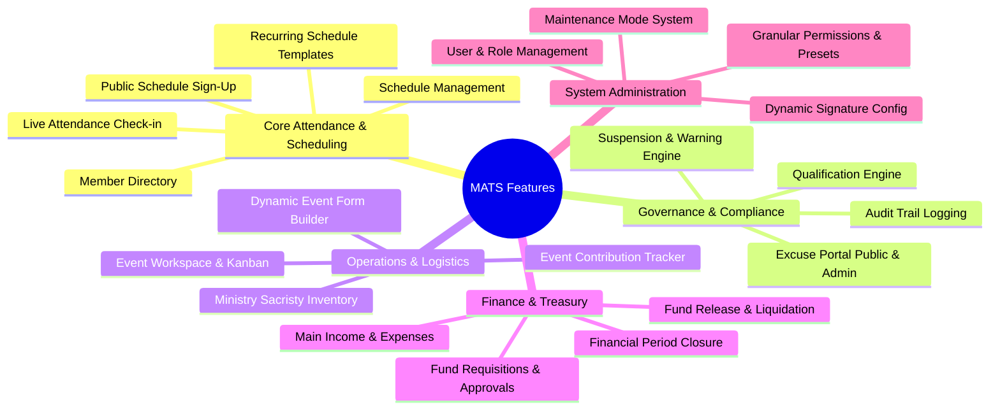
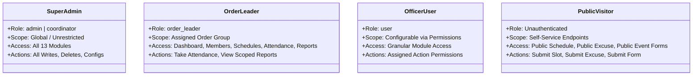
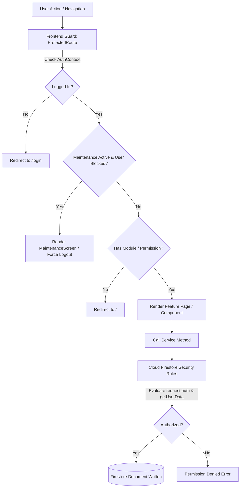
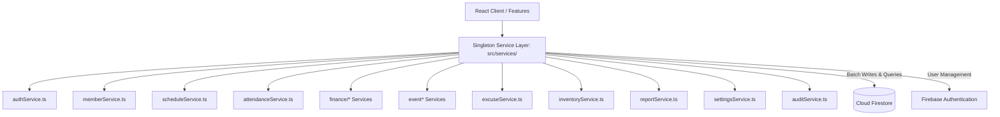
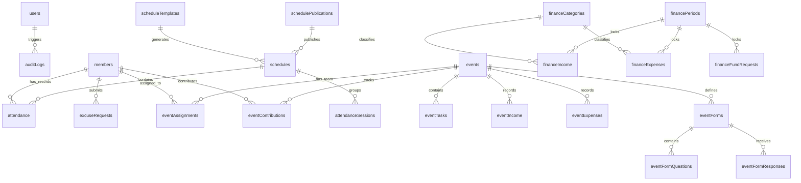
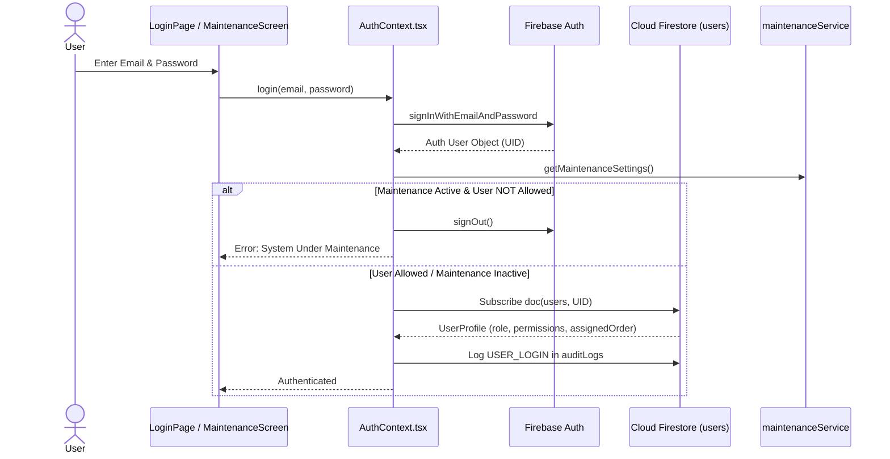
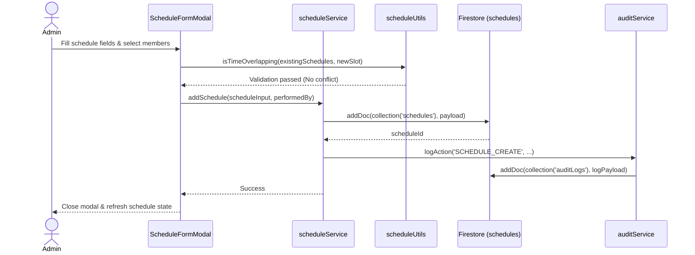
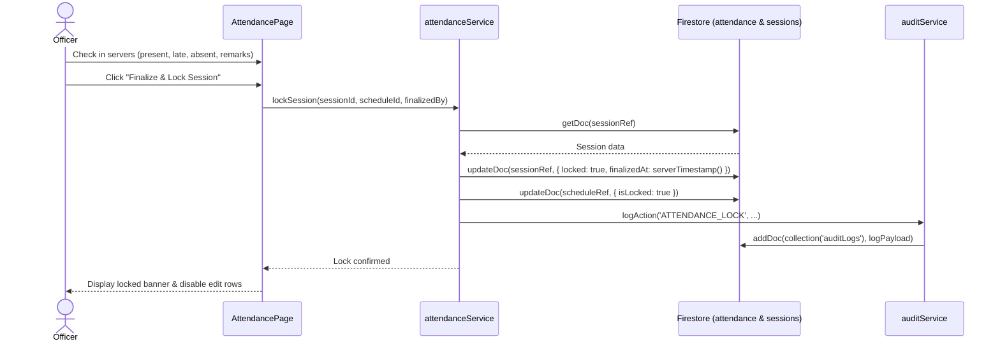
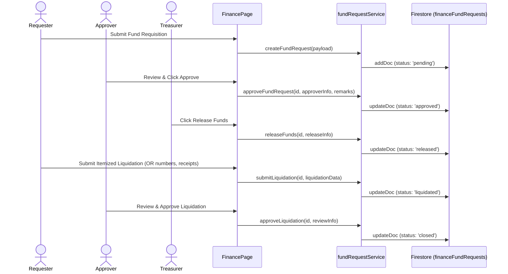
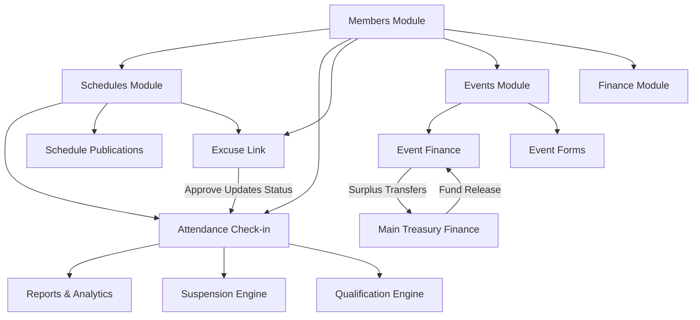

# Project Discovery: MATS (Ministry Attendance Tracking System)

> **Document Type:** System Discovery & Baseline Technical Inventory  
> **Target System:** MATS (Ministry Attendance Tracking System / Ministry Administration & Tracking System)  
> **Status:** Discovery Complete — Current Real State Verified  
> **Date of Discovery:** September 2026  
> **Inspection Method:** Direct source code, configuration, rules, and layout static audit.

---

## 1. Project Overview

### 1.1 Project Identification
* **Project Name:** MATS (Ministry Attendance Tracking System / Ministry Administration & Tracking System)
* **Application Type:** Progressive Web Application (PWA) / Single Page Application (SPA)
* **Target Organization:** Church Ministries (specifically the *Ministry of Altar Servers*, Sacred Heart of Jesus Parish – MBS)

### 1.2 System Purpose & Problems Solved
MATS is an administrative portal and public self-service platform designed to digitize church ministry operations. It addresses several historical operational challenges:
1. **Manual Rostering & Scheduling Conflicts:** Automates mass and duty assignments, prevents double-booking across concurrent services, and manages recurring templates.
2. **Attendance Tracking & Accountability:** Replaces paper attendance sheets with digital check-ins, record locking, and tamper-resistant session finalization.
3. **Automated Policy Enforcement:** Evaluates absences against customizable monthly policy thresholds (e.g., Warning at 2 absences, Suspension at 3) to enforce active standing rules and track unsuspension requirements.
4. **Decentralized Ministry Operations:** Provides dedicated workspaces for Events, Inventory/Sacristy asset tracking, Treasury/Finance operations, Public Excuses, and Dynamic Public Event Registration Forms.
5. **Multi-Format Reporting:** Generates client-side landscape PDF reports with dynamic multi-column signatory blocks, CSV exports for spreadsheets, and formatted Facebook Community text summaries.

### 1.3 Main Users & Personas
* **Super Administrators & Coordinators (`admin`, `coordinator`):** Full unrestricted access to all modules, user account management, granular permissions, system settings, policy thresholds, maintenance mode controls, and immutable audit logs.
* **Order Leaders / Group Captains (`order_leader`):** Group-scoped leaders who manage attendance, monitor absences, and view reports filtered to their assigned order (e.g., *Order of San Pedro*, *Order of San Juan*, *Order of San Tiago*, *Order of San Andres*, *Officers*, *Squires*).
* **Officers & Attendance Takers (`user` with specific permissions):** Assigned staff who record mass attendance, submit duty reports, or manage event tasks and logistics.
* **Treasurers & Financial Officers (`user` with finance permissions):** Manage income, direct expenses, fund requisitions, approvals, releases, liquidations, and financial period closures.
* **General Altar Servers & Public Community Members:** Unauthenticated users accessing public portals to sign up for published schedule slots, submit excuse requests, track excuse status, and complete event registration/survey forms.

### 1.4 Complete Technology Stack

| Layer / Aspect | Technology / Library | Version | Implementation Details |
| :--- | :--- | :--- | :--- |
| **Core Framework** | React | `^19.2.7` | StrictMode enabled, React 19 hooks, client-side rendering |
| **Runtime & Language** | TypeScript | `~6.0.2` | Strict TypeScript configuration (`tsconfig.app.json`, `tsconfig.json`) |
| **DOM Renderer** | React DOM | `^19.2.7` | Root rendered via `createRoot` in `src/main.tsx` |
| **Build Tool & Bundler** | Vite | `^8.1.0` | `@vitejs/plugin-react` (`^6.0.2`), `@tailwindcss/vite` (`^4.3.1`) |
| **Styling Framework** | Tailwind CSS | `^4.3.1` | Tailwind v4 with `@import "tailwindcss";` in `src/index.css` |
| **Routing** | React Router DOM | `^7.18.0` | `BrowserRouter`, `Routes`, `Route`, `Navigate` (v7 syntax) |
| **Asynchronous Query Cache** | TanStack React Query | `^5.101.1` | `QueryClientProvider` wrapped at root (`staleTime: 5 mins`) |
| **Backend & Cloud Database** | Firebase SDK | `^12.15.0` | Cloud Firestore (v12 modular SDK), Firebase Auth |
| **Authentication** | Firebase Authentication | `^12.15.0` | Email/Password provider, `browserLocalPersistence` |
| **Document Generation** | jsPDF & AutoTable | `jspdf ^4.2.1`, `jspdf-autotable ^5.0.8` | Client-side dynamic PDF generation with custom tables & footers |
| **PDF Parsing** | PDF.js | `pdfjs-dist ^4.4.168` | Client-side PDF text extraction for bulk member imports |
| **Charts & Visualization** | Recharts | `^3.10.1` | Responsive charts (PieChart, BarChart, LineChart) in Dashboard |
| **Interactive Walkthrough** | React Joyride | `^3.2.0` | Guided user onboarding tour with Filipino/Tagalog localization |
| **Linter** | Oxlint | `^1.69.0` | Fast static analysis linter |
| **PWA Capabilities** | Custom Service Worker | Custom (`/sw.js`) | Offline cache banner, install prompt, update notification |
| **Hosting & Deployment** | Firebase Hosting | Firebase CLI | Single-Page Application rewrites (`firebase.json`) |

---

## 2. Complete Feature Inventory



### 2.1 Core Ministry Features

#### 1. Member Directory (`/members`)
* **Purpose:** Centralized masterlist management for altar servers.
* **Access Roles:** Super Admins, Order Leaders, and users with `canManageMembers` or `canViewMembers`.
* **Routes & Components:** `/members` -> `MembersPage.tsx`, `MemberTable.tsx`, `MemberFormModal.tsx`, `MemberImportModal.tsx`, `MemberPDFImportModal.tsx`, `MemberExportModal.tsx`, `BulkRankEditModal.tsx`, `BulkOrderEditModal.tsx`.
* **Actions:** Add single member, edit member details, archive/restore members, bulk rank editing, bulk order assignment, import from CSV, import from official PDF roster (extracting ranks and orders), export to CSV/PDF.
* **Database Collections:** `members`, `auditLogs`.
* **Status:** Fully Implemented.

#### 2. Schedule Management (`/schedules`)
* **Purpose:** Create, edit, assign, auto-generate, and publish liturgical schedules and meetings.
* **Access Roles:** Super Admins, Order Leaders, users with `canManageSchedules` or `canViewSchedules`.
* **Routes & Components:** `/schedules` -> `SchedulesPage.tsx`, `CalendarView.tsx`, `ScheduleCard.tsx`, `ScheduleFormModal.tsx`, `ScheduleDetailsModal.tsx`, `AssignmentModal.tsx`, `AdminEditMemberScheduleModal.tsx`, `BulkDeleteMonthModal.tsx`, `CSVImporterModal.tsx`, `TemplateManagerModal.tsx`, `PublicationsTab.tsx`, `PublicationFormModal.tsx`, `ManageSubmissionsModal.tsx`, `SchedulePdfExportModal.tsx`.
* **Actions:** Single schedule creation, calendar and list views, duty assignment with conflict check (detecting double-booking), auto-assignment algorithm (`autoAssignService`), CSV bulk import, bulk delete by month, recurring schedule generation, schedule publication with self-service constraints (max Sunday/weekday limits), export monthly schedules to landscape PDF with signatories.
* **Database Collections:** `schedules`, `scheduleTemplates`, `schedulePublications`, `members`, `auditLogs`.
* **Status:** Fully Implemented.

#### 3. Public Self-Service Schedule Portal (`/public/schedule/:id`)
* **Purpose:** Allows altar servers to view published schedules and sign up for open duty slots on their mobile devices without logging in.
* **Access Roles:** Public / Unauthenticated servers (guarded by `PublicMaintenanceGuard`).
* **Routes & Components:** `/public/schedule/:id` -> `PublicSchedulePage.tsx`.
* **Actions:** Select server profile from dropdown/combobox, pick available mass slots, enforce max Sunday/weekday constraints set in publication, submit slot selections.
* **Database Collections:** `schedules` (update `assignedMembers`), `schedulePublications` (track `submittedMembers`).
* **Status:** Fully Implemented.

#### 4. Live Attendance Check-In & Finalization (`/attendance`)
* **Purpose:** Real-time attendance check-in during masses, meetings, and formations.
* **Access Roles:** Super Admins, Order Leaders, users with `canTakeAttendance`.
* **Routes & Components:** `/attendance` -> `AttendancePage.tsx`, `AttendanceHeader.tsx`, `AttendanceRow.tsx`, `AddOtherServerModal.tsx`, `UnlockSessionModal.tsx`, `CommunityReportModal.tsx`.
* **Actions:** Mark status (`present`, `late`, `absent`, `excused`, `observer`, `formation`, `alumni`), input custom remarks, add unassigned "Other Servers" who served, finalize and lock session, unlock locked session (requires password re-authentication), generate Facebook Community formatted text summary.
* **Database Collections:** `attendanceSessions`, `attendance`, `schedules`, `members`, `auditLogs`.
* **Status:** Fully Implemented.

#### 5. Reports, Analytics & Qualifications (`/reports`)
* **Purpose:** Evaluate attendance rates, absence metrics, warning/suspension statuses, Holy Hour analytics, and clearance qualifications.
* **Access Roles:** Super Admins, Order Leaders, users with `canViewReports` / `canExportReports`.
* **Routes & Components:** `/reports` -> `ReportsPage.tsx`, `FilterBar.tsx`, `SummaryCards.tsx`, `AbsenceBreakdownModal.tsx`, `MemberReportExportModal.tsx`, `QualificationsTab.tsx`, `QualificationsExportModal.tsx`, `HolyHourAnalyticsTab.tsx`, `HolyHourServiceHistoryModal.tsx`.
* **Actions:** Filter by date range, rank, order group, and schedule category; evaluate attendance policy thresholds; inspect detailed absence breakdown modal; calculate server renewal and investiture qualification criteria; generate landscape PDF attendance reports; export qualification audit summaries; export CSV rosters.
* **Database Collections:** `members`, `schedules`, `attendance`, `settings`.
* **Status:** Fully Implemented.

---

### 2.2 Operations & Logistics Features

#### 6. Public Excuse Submission & Status Tracking (`/public/excuse`)
* **Purpose:** Public self-service portal for members to submit excuse letters for missed schedules and track request status.
* **Access Roles:** Public / Unauthenticated (guarded by `PublicMaintenanceGuard`).
* **Routes & Components:** `/public/excuse` -> `PublicExcusePage.tsx`.
* **Actions:** Select member identity, select missed schedules, enter reason and additional notes, generate tracking number (`EX-YYYYMM-XXXXX`) via Firestore counter transaction, lookup status by tracking number or member selection.
* **Database Collections:** `excuseRequests`, `excuseStatus`, `counters`, `members`, `schedules`.
* **Status:** Fully Implemented.

#### 7. Administrative Excuse Management (`/excuses`)
* **Purpose:** Review, approve, reject, or cancel member excuse submissions.
* **Access Roles:** Super Admins, users with `canReviewExcuses` or `canApproveExcuses`.
* **Routes & Components:** `/excuses` -> `AdminExcusePage.tsx`, `ReviewExcuseModal.tsx`.
* **Actions:** View submitted requests, review reasons, approve request (which automatically updates the corresponding `attendance` record status to `excused`), reject request with reason, cancel/delete request.
* **Database Collections:** `excuseRequests`, `excuseStatus`, `attendance`, `auditLogs`.
* **Status:** Fully Implemented.

#### 8. Event Workspace & Project Management (`/events`, `/events/:id`)
* **Purpose:** End-to-end planning and execution workspace for ministry events, feasts, seminars, and activities.
* **Access Roles:** Super Admins, users with `events` module access (`canManageEvents`, etc.).
* **Routes & Components:** `/events` -> `EventsPage.tsx`; `/events/:id` -> `EventDetailsPage.tsx`, `OverviewTab.tsx`, `TaskBoard.tsx`, `TeamBoard.tsx`, `TimelineView.tsx`, `EventFormsTab.tsx`, `TaskFormModal.tsx`, `TaskCard.tsx`.
* **Actions:** Create/archive events, assign committee members and roles, manage Kanban task boards with status workflows (`Not Started`, `In Progress`, `Waiting`, `Blocked`, `Completed`), task checklist items, timeline views, link to schedules and fund requests.
* **Database Collections:** `events`, `eventTasks`, `eventAssignments`, `eventRoles`, `eventChecklists`, `auditLogs`.
* **Status:** Fully Implemented.

#### 9. Dynamic Event Form Builder & Public Submissions (`/public/events/:eventId/forms/:formId`, `/public/forms/:formId`)
* **Purpose:** Google Forms-like dynamic form builder for event registrations, surveys, shirt orders, and consent forms.
* **Access Roles:** Form Builder: Admin/Staff with `canCreateEventForms`/`canEditEventForms`. Submissions: Public.
* **Routes & Components:** `EventFormsTab.tsx`, `EventFormBuilderModal.tsx`, `EventFormResponsesModal.tsx`, `PublicEventFormPage.tsx`.
* **Actions:** Add questions with 14 supported question types (text, choice, dropdown, checkbox, member selector, companion repeater, etc.), configure conditional visibility rules, set option capacity limits, track response counts, submit public responses with tracking numbers, export responses to CSV and PDF.
* **Database Collections:** `eventForms`, `eventFormQuestions`, `eventFormResponses`, `counters`, `members`, `auditLogs`.
* **Status:** Fully Implemented.

#### 10. Event Finance & Contribution Tracker (Inside `/events/:id`)
* **Purpose:** Track financial income, expenses, liquidations, and contributor collections specifically tied to an event.
* **Access Roles:** Super Admins, Event Heads, and users with `canViewEventFinance`, `canAddEventContributions`, etc.
* **Routes & Components:** Inside `EventDetailsPage.tsx`: `EventIncomeModal.tsx`, `EventLiquidationModal.tsx`, `TransferToMainFundsModal.tsx`, `EventFinanceReportModal.tsx`.
* **Actions:** Record event income (cash, GCash, bank transfer), record direct event expenses with receipt OR numbers, track member contributions with collector ("care of") metadata, link contributions to main funds (`financeIncome`) or other events, transfer surplus funds to main treasury, generate event liquidation PDF reports.
* **Database Collections:** `eventIncome`, `eventExpenses`, `eventFundTransfers`, `eventFinanceCategories`, `eventContributionPurposes`, `eventContributions`, `financeIncome`, `financeExpenses`, `auditLogs`.
* **Status:** Fully Implemented.

#### 11. Ministry Sacristy Inventory (`/inventory`)
* **Purpose:** Track liturgical items, vestments, sports gear, tech supplies, condition states, and storage locations.
* **Access Roles:** Super Admins, users with `canViewInventory` / `canManageInventory`.
* **Routes & Components:** `/inventory` -> `InventoryPage.tsx`, `InventoryItemModal.tsx`, `ManageInventoryCategoriesModal.tsx`.
* **Actions:** Add/edit inventory items, quantity tracking, condition tracking (`Brand New`, `Good`, `Fair / Usable`, `Damaged / For Repair`), stock status (`In Stock`, `Low Stock`, `Out of Stock`, `Under Maintenance`), category management, storage location assignment, real-time Firestore subscription (`onSnapshot`).
* **Database Collections:** `inventory_items`, `inventory_categories`, `auditLogs`.
* **Status:** Fully Implemented.

---

### 2.3 Treasury & Financial Management Features

#### 12. Main Finance & Treasury (`/finance`)
* **Purpose:** Comprehensive financial ledger, income tracking, expense management, fund requisitions, multi-tier approvals, cash releases, liquidation audits, and monthly period locks.
* **Access Roles:** Users with `canViewFinanceDashboard` (Super Admins, Treasurers, Coordinators).
* **Routes & Components:** `/finance` -> `FinancePage.tsx`, `FinanceExportModal.tsx`, `FundRequisitionExportModal.tsx`, `LiquidationExportModal.tsx`.
* **Actions:** 
  * General ledger balance calculation and monthly summaries.
  * Record and categorize general income (`financeIncome`) with soft delete/archiving.
  * Record direct expenses (`financeExpenses`).
  * Create fund requests with itemized expected expenses (`financeFundRequests`).
  * Approve / reject fund requests with remarks.
  * Release funds with payee name, release date, and voucher reference.
  * Submit and review itemized liquidation with receipt OR numbers, return remaining funds, or record reimbursements.
  * Close and reopen financial periods (`financePeriods`) to prevent backdated modifications.
  * Export official Fund Requisition vouchers, Liquidation reports, and Monthly Financial statements to PDF with dynamic multi-signatory blocks.
* **Database Collections:** `financeIncome`, `financeExpenses`, `financeCategories`, `financeFundRequests`, `financePeriods`, `counters`, `auditLogs`.
* **Status:** Fully Implemented.

---

### 2.4 Administrative & System Governance Features

#### 13. User & Role Management (`/users`)
* **Purpose:** Manage staff accounts, assign system roles, assign order scopes, apply permission presets, and configure fine-grained module/action privileges.
* **Access Roles:** Super Admins (`admin`, `coordinator`) only.
* **Routes & Components:** `/users` -> `UsersPage.tsx`.
* **Actions:** Create new user accounts (associating email, role, display name), toggle active/disabled status, assign Order Leader scopes, customize 40+ granular action permissions across all modules, apply permission presets, re-send password resets.
* **Database Collections:** `users`, `auditLogs`.
* **Status:** Fully Implemented.

#### 14. System Settings & Governance Policies (`/settings`)
* **Purpose:** Configure ministry-wide operational policies, signature presets, report templates, and emergency maintenance controls.
* **Access Roles:** Super Admins (`admin`, `coordinator`) only.
* **Routes & Components:** `/settings` -> `SettingsPage.tsx`, `PolicySettingsCard.tsx`, `SignatureSettingsCard.tsx`, `MaintenanceSettingsCard.tsx`, `ReportTemplateEditor.tsx`.
* **Actions:**
  * **Absence & Suspension Policy:** Configure warning threshold (default 2), suspension threshold (default 3), evaluation window (default 1 month), evaluation month selector, included schedule types (Sundays, weekdays, meetings), and unsuspension requirements (meeting/formation attendance).
  * **Dynamic Signatures:** Configure official signatories, titles, organizations, column alignments, and presets (Treasury Standard, General, Audit Verification, Approval Only).
  * **Community Report Template:** Customize Facebook/social media announcement templates with mustache-style placeholders.
  * **System Maintenance Mode:** Toggle system-wide lockdown, custom maintenance message, scheduled completion time, and whitelist of authorized user UIDs/emails.
* **Database Collections:** `settings` (docs: `suspensionPolicy`, `signaturePresets`, `communityReport`, `qualificationPresets`, `maintenanceMode`), `auditLogs`.
* **Status:** Fully Implemented.

#### 15. System Audit Trail (`/audit`)
* **Purpose:** Immutable, chronological log of all administrative actions, data modifications, login events, and approvals.
* **Access Roles:** Super Admins (`admin`, `coordinator`) only.
* **Routes & Components:** `/audit` -> `AuditPage.tsx`.
* **Actions:** View paginated audit logs, filter by category (`member`, `schedule`, `attendance`, `settings`, `system`, `excuse`, `finance`, `events`), search by action or user email, view detailed payload JSON modal.
* **Database Collections:** `auditLogs` (Append-only in Firestore rules).
* **Status:** Fully Implemented.

#### 16. Authentication & Password Management (`/login`, `/change-password`)
* **Purpose:** Secure user authentication and self-service password changes.
* **Access Roles:** Login is Public; Change Password is for any Authenticated User.
* **Routes & Components:** `/login` -> `LoginPage.tsx`; `/change-password` -> `ChangePasswordPage.tsx`.
* **Actions:** Sign in with email and password, re-authenticate for sensitive operations, change user password with validation.
* **Database Collections:** `users`, Firebase Auth.
* **Status:** Fully Implemented.

#### 17. Dashboard Overview (`/`)
* **Purpose:** Real-time administrative metrics, upcoming duties, birthday celebrants, and quick links.
* **Access Roles:** All authenticated users (with order-scoped data filtering for `order_leader`).
* **Routes & Components:** `/` -> `DashboardOverview.tsx`, `DashboardCharts.tsx`.
* **Actions:** View active member counts, monthly suspensions, upcoming schedules, ongoing services, today's schedule list, upcoming birthdays for the month, order-themed header cards, and high-level charts.
* **Database Collections:** `members`, `schedules`, `attendanceSessions`, `attendance`, `events`, `eventTasks`, `eventAssignments`.
* **Status:** Fully Implemented (Note: Two charts currently use static dataset representations).

---

## 3. User Roles and Permissions

### 3.1 Defined Roles



#### Role 1: Super Administrator / Coordinator (`admin`, `coordinator`)
* **Accessible Routes:** All authenticated routes (`/`, `/members`, `/schedules`, `/attendance`, `/reports`, `/finance`, `/events`, `/events/:id`, `/inventory`, `/excuses`, `/users`, `/settings`, `/audit`, `/change-password`).
* **Allowed Actions:** Unrestricted creation, mutation, deletion, archiving, configuration, user provisioning, and maintenance management.
* **Data Scopes:** System-wide across all orders and ministries.
* **UI Features:** Renders full sidebar navigation, administrative controls, user edit modals, settings tabs, and audit log viewer.

#### Role 2: Order Leader (`order_leader`)
* **Accessible Routes:** `/`, `/schedules`, `/attendance`, `/members`, `/reports`, `/change-password` (plus any explicitly granted operational modules).
* **Allowed Actions:** View members, take and save attendance, view schedules, view and export attendance reports.
* **Data Scopes:** Automatically filtered to their `assignedOrder` (e.g., *Order of San Pedro*) in Dashboard, Reports, and Member directory.
* **Backend / Database Restrictions:** Enforced on client services and restricted by Firestore rules when permissions are evaluated.

#### Role 3: Standard User / Officer (`user`)
* **Accessible Routes:** Determined strictly by `profile.permissions.allowedModules` (or legacy defaults: `/`, `/schedules`, `/attendance`, `/reports`).
* **Allowed Actions:** Governed by 40+ granular permission booleans in `profile.permissions` (e.g., `canTakeAttendance`, `canAddIncome`, `canCreateFundRequest`, `canManageEvents`, `canManageInventory`).
* **Backend Restrictions:** Firestore security rules verify `getUserData().permissions[permissionKey] == true`.

#### Role 4: Public / Unauthenticated User
* **Accessible Routes:** `/login`, `/public/schedule/:id`, `/public/excuse`, `/public/events/:eventId/forms/:formId`, `/public/forms/:formId`.
* **Allowed Actions:** Public schedule sign-up (updates `assignedMembers` and `submittedMembers`), submit excuse requests (creates `excuseRequests` and `excuseStatus`), submit event form responses (creates `eventFormResponses` and updates counters).
* **Database Restrictions:** Firestore rules allow targeted public creation and reading on public-facing collections.

---

### 3.2 Authorization Implementation Architecture



1. **Frontend Authorization:**
   * Handled in `src/features/authentication/components/ProtectedRoute.tsx` and `AuthContext.tsx`.
   * Evaluates `hasModuleAccess(moduleKey)` and `canAction(actionKey)`.
   * Super admins (`admin`, `coordinator`) automatically bypass all client permission checks.
2. **Backend / Firestore Authorization:**
   * Enforced at database engine level in `firestore.rules`.
   * Evaluates helper functions: `isAuthenticated()`, `isSuperAdmin()`, `hasPermission(permissionKey)`, and `hasModuleAccess(moduleKey)`.
   * Helper function `isEventHeadOrCreator(eventId)` provides contextual row-level permissions for event managers.

---

## 4. Route and Page Inventory

### 4.1 Production Route Table

| Route | Page / Component | Public / Protected | Required Role / Permission | Purpose | Main Components Rendered |
| :--- | :--- | :--- | :--- | :--- | :--- |
| `/login` | `LoginPage.tsx` | Public | Unauthenticated (Redirects to `/` if logged in) | User sign-in portal | Minimal login card, email/password inputs, maintenance alerts |
| `/public/schedule/:id` | `PublicSchedulePage.tsx` | Public | None (Guarded by `PublicMaintenanceGuard`) | Public self-service mass sign-up | Server selection, duty slot picker, rule validator |
| `/public/excuse` | `PublicExcusePage.tsx` | Public | None (Guarded by `PublicMaintenanceGuard`) | Public excuse submission & tracking | Multi-step excuse form, tracking number lookup panel |
| `/public/events/:eventId/forms/:formId` | `PublicEventFormPage.tsx` | Public | None (Guarded by `PublicMaintenanceGuard`) | Public event registration & survey form | Dynamic question renderer, validation engine, companion repeater |
| `/public/forms/:formId` | `PublicEventFormPage.tsx` | Public | None (Guarded by `PublicMaintenanceGuard`) | Alias route for public dynamic forms | Identical to above |
| `/` | `DashboardOverview.tsx` | Protected | Authenticated (All Roles) | System overview, KPIs, birthdays, duties | Order banner, KPI cards, `DashboardCharts`, duty lists |
| `/members` | `MembersPage.tsx` | Protected | Module `members` (`canViewMembers`) | Server roster & profile management | `MemberTable`, search/filter bar, import/export modals |
| `/schedules` | `SchedulesPage.tsx` | Protected | Module `schedules` (`canViewSchedules`) | Mass & meeting schedule management | `CalendarView`, `ScheduleCard`, `TemplateManagerModal`, `PublicationsTab` |
| `/attendance` | `AttendancePage.tsx` | Protected | Module `attendance` (`canTakeAttendance`) | Live mass attendance recording & session lock | `AttendanceHeader`, `AttendanceRow`, `CommunityReportModal`, `UnlockSessionModal` |
| `/reports` | `ReportsPage.tsx` | Protected | Module `reports` (`canViewReports`) | Attendance analytics, policies & clearances | `FilterBar`, `SummaryCards`, `QualificationsTab`, `HolyHourAnalyticsTab` |
| `/finance` | `FinancePage.tsx` | Protected | Module `finance` (`canViewFinanceDashboard`) | Treasury ledger, requisitions & liquidations | Balance cards, Ledger table, Requisition modals, Period controls |
| `/events` | `EventsPage.tsx` | Protected | Module `events` (`canManageEvents`) | Event roster & workspace list | Event cards, status filters, create event modal |
| `/events/:id` | `EventDetailsPage.tsx` | Protected | Module `events` (`canManageEvents`) | Event workspace & logistics management | `OverviewTab`, `TaskBoard`, `TeamBoard`, `TimelineView`, `EventFormsTab` |
| `/inventory` | `InventoryPage.tsx` | Protected | Module `inventory` (`canViewInventory`) | Sacristy asset & gear tracking | Filterable inventory table, `InventoryItemModal`, category modal |
| `/excuses` | `AdminExcusePage.tsx` | Protected | Module `excuses` (`canReviewExcuses`) | Review and approve excuse submissions | Filterable request table, `ReviewExcuseModal` |
| `/users` | `UsersPage.tsx` | Protected | Super Admin Only (`adminOnly={true}`) | Staff accounts & permission configurations | User table, permission preset manager, granular matrix modal |
| `/settings` | `SettingsPage.tsx` | Protected | Super Admin Only (`adminOnly={true}`) | Governance policies, signatures, maintenance | `PolicySettingsCard`, `SignatureSettingsCard`, `MaintenanceSettingsCard` |
| `/audit` | `AuditPage.tsx` | Protected | Super Admin Only (`adminOnly={true}`) | Immutable audit log trail | Audit table, category filter, JSON detail modal |
| `/change-password` | `ChangePasswordPage.tsx` | Protected | Authenticated (All Roles) | Self-service user password change | Old/new password inputs, validation feedback |
| `*` | Catch-all | Fallback | None | Redirects invalid URLs to `/` | `<Navigate to="/" replace />` |

### 4.2 Standalone / Unrouted Preview Files
The repository contains 8 unrouted preview/prototype pages under feature directories (`src/features/*/pages/*PreviewPage.tsx`):
* `MembersPreviewPage.tsx`
* `SchedulePreviewPage.tsx`
* `AttendancePreviewPage.tsx`
* `ReportsPreviewPage.tsx`
* `FinancePreviewPage.tsx`
* `EventsPreviewPage.tsx`
* `ExcusePreviewPage.tsx`
* `PreviewNavigation.tsx`

*Observation:* These files are static design prototypes and are **not** wired into `src/App.tsx`. They serve as design references.

---

## 5. Frontend Architecture

### 5.1 Directory Organization

```
src/
├── app/                  # Application configuration
├── assets/               # Static icons, logos, and images
├── components/           # Reusable shared UI primitives (Card, Modal, Dialog, Pagination, etc.)
│   └── signatures/       # Dynamic multi-column signature block component
├── context/              # App-level contexts (MaintenanceContext, PWAContext, TutorialContext)
├── features/             # Feature-sliced modules
│   ├── attendance/       # Check-in, session locking, community reports
│   ├── audit/            # System audit trail viewer
│   ├── authentication/   # Auth context, guards, login, change password
│   ├── dashboard/        # Dashboard overview, charts, stats
│   ├── events/           # Event workspace, Kanban, forms, contributions
│   ├── excuse/           # Public and admin excuse tracking
│   ├── finance/          # Treasury ledger, requisitions, liquidations
│   ├── inventory/        # Ministry asset inventory
│   ├── maintenance/      # Maintenance lock screens & guards
│   ├── members/          # Member roster, PDF/CSV importers, rank editors
│   ├── preview/          # UI prototyping components
│   ├── reports/          # Attendance reports, qualifications, holy hour
│   ├── schedules/        # Scheduling, calendar, templates, publications
│   ├── settings/         # Policies, signatures, template editors
│   └── users/            # User account & permission administration
├── firebase/             # Firebase SDK client initialization
├── hooks/                # Custom React hooks (inactivity redirect, tutorial steps)
├── layouts/              # Shell layout (DashboardLayout)
├── services/             # Firestore & business logic singleton services
│   └── finance/          # Dedicated sub-services for Treasury
├── types/                # Domain TypeScript models and interfaces
└── utils/                # Pure mathematical, PDF, and formatting utilities
```

### 5.2 Component Categorization

#### 1. Shared Global Components (`src/components/`)
* `Card.tsx`: Standard rounded white surface container with header support.
* `Modal.tsx`: Glassmorphic modal dialog wrapper with backdrop, size presets, and ESC key listener.
* `Dialog.tsx`: Semantic dialog primitives (`AlertModal`, `ConfirmModal`, `PasswordConfirmModal`, `ActionDialog`).
* `Pagination.tsx`: Accessible pagination bar with page windowing and previous/next controls.
* `Loading.tsx`: Centered spinner and progress bar indicators.
* `MemberCombobox.tsx`: Typeahead search combobox with custom text fallback.
* `MemberSearchDropdown.tsx`: Dropdown selector with sublabels and clear button.
* `FormattedText.tsx`: Multi-line text parser preserving breaks and links.
* `OfflineBanner.tsx`: Top banner alerting users when network connection is lost.
* `InstallPWAButton.tsx`: Browser install prompt trigger for mobile/desktop PWA.
* `PWAUpdatePrompt.tsx`: Toast notifying users when a new service worker build is waiting.
* `DynamicSignatureConfig.tsx`: Multi-column signatory configuration and visual preview.

#### 2. Layout Components (`src/layouts/`)
* `DashboardLayout.tsx`: Authenticated app shell containing top navigation bar, collapsible desktop sidebar, mobile swipe-to-open navigation drawer, breadcrumbs, user status badge, and joyride walkthrough hook.

#### 3. State Management Architecture
* **Server State & Cache:** TanStack React Query (`@tanstack/react-query`) wraps the app in `main.tsx`.
* **Global Auth & User State:** `AuthContext.tsx` subscribes in real time (`onAuthStateChanged`, `onSnapshot` on user doc).
* **Global Maintenance State:** `MaintenanceContext.tsx` subscribes in real time (`onSnapshot` on `settings/maintenanceMode`).
* **PWA & Network State:** `PWAContext.tsx` tracks online/offline events and `beforeinstallprompt`.
* **Interactive Tutorial State:** `TutorialContext.tsx` controls React Joyride step execution.
* **Feature-Local State:** Standard React `useState`, `useReducer`, `useMemo`, `useCallback`, and `useRef`.

---

## 6. UI/UX Design System & Pattern Analysis

### 6.1 Visual Tokens & Foundation
* **Color Palette Baseline:**
  * Background: Slate 50 (`#f8fafc`)
  * Neutral Surfaces: Pure White (`#ffffff`), Slate 100/200 borders
  * Primary Action: Indigo (`bg-indigo-600`, `hover:bg-indigo-700`, `text-indigo-600`)
  * Destructive: Rose / Red (`bg-rose-600`, `bg-red-600`, `text-rose-600`)
  * Success / Affirmative: Emerald / Green (`bg-emerald-600`, `text-emerald-600`)
  * Warning / Attention: Amber (`bg-amber-500`, `text-amber-700`)
* **Order Theme Palette (Vibrant & Distinct):**
  * *Order of San Pedro:* Red theme (`bg-red-50`, `border-red-200`, `text-red-700`, `bg-red-600`)
  * *Order of San Juan:* Blue theme (`bg-blue-50`, `border-blue-200`, `text-blue-700`, `bg-blue-600`)
  * *Order of San Tiago:* Emerald theme (`bg-emerald-50`, `border-emerald-200`, `text-emerald-700`, `bg-emerald-600`)
  * *Order of San Andres:* Amber theme (`bg-amber-50`, `border-amber-200`, `text-amber-700`, `bg-amber-500`)
  * *Officers:* Purple theme (`bg-purple-50`, `border-purple-200`, `text-purple-700`, `bg-purple-600`)
  * *Squires:* Indigo/Pink theme (`bg-indigo-50`, `border-indigo-200`, `text-indigo-700`, `bg-indigo-600`)

---

### 6.2 Competing UI Patterns & Dominance Analysis

#### 1. Modal & Overlay Patterns

| Pattern | Location(s) | Implementation Summary | Usage Scope |
| :--- | :--- | :--- | :--- |
| **Shared Glassmorphic Modal** | `src/components/Modal.tsx` | `fixed inset-0 z-[60] bg-slate-900/60 backdrop-blur-md rounded-3xl`, animated zoom | Event modals, Inventory modals, Export modals |
| **Shared Semantic Dialogs** | `src/components/Dialog.tsx` | `AlertModal`, `ConfirmModal`, `PasswordConfirmModal`, `ActionDialog` with variant icons | Destructive actions, system alerts, password confirmations |
| **Page-Local Custom Overlays** | `UsersPage.tsx`, `AuditPage.tsx`, `FinancePage.tsx`, `AddOtherServerModal.tsx` | Hand-authored fixed overlays, varying z-indices (`z-50` to `z-[100]`), varying radius (`rounded-xl` to `rounded-3xl`) | Admin forms, custom finance wizards, attendance session modals |
| **Full-Screen Workspace Overlays** | `EventFormResponsesModal.tsx`, `ManageSubmissionsModal.tsx` | Dedicated full-viewport modal sheets with sticky header and split layout | Dense data inspection and submission grading |

> **DOMINANT IMPLEMENTATION:** `src/components/Modal.tsx` + `src/components/Dialog.tsx`. Newer modules consistently use this pair. Older pages (`UsersPage`, `FinancePage`) retain bespoke overlays.

---

#### 2. Button Patterns

| Pattern | Location(s) | Implementation Summary | Usage Scope |
| :--- | :--- | :--- | :--- |
| **V2 Indigo Button** | `DashboardOverview.tsx`, `InventoryPage.tsx`, `EventsPage.tsx` | `rounded-xl px-4 py-2.5 bg-indigo-600 text-white font-bold text-xs/sm shadow-xs hover:bg-indigo-700 active:scale-95` | Primary page & form submissions across newer features |
| **Legacy Blue Button** | `LoginPage.tsx`, `UsersPage.tsx`, `MembersPage.tsx` | `rounded-lg px-4 py-2 bg-blue-600 text-white font-medium text-sm shadow-sm hover:bg-blue-700` | Older admin and member actions |
| **Tinted Semantic Actions** | `AttendancePage.tsx`, `ReportsPage.tsx` | Color-coded buttons (`bg-purple-50 text-purple-700`, `bg-emerald-50 text-emerald-700`) | Secondary workflow tools (Facebook summary, batch lock) |
| **Icon-Only Table Actions** | `MemberTable.tsx`, `UsersPage.tsx`, `FinancePage.tsx` | `p-1.5 rounded-lg border hover:bg-slate-50 text-slate-500` | Row edit, delete, download, and view actions |

> **DOMINANT IMPLEMENTATION:** **V2 Indigo Button pattern** (`rounded-xl`, indigo 600/700, white text, subtle shadow, active scale).

---

#### 3. Form Input & Field Patterns

| Pattern | Location(s) | Implementation Summary | Usage Scope |
| :--- | :--- | :--- | :--- |
| **V2 Slate / Indigo Fields** | `EventFormModal.tsx`, `TaskFormModal.tsx`, `PublicEventFormPage.tsx` | `bg-slate-50 border border-slate-200 rounded-xl px-3.5 py-2.5 text-sm focus:bg-white focus:ring-2 focus:ring-indigo-500/25` | Modern event and task forms |
| **Legacy Gray / Blue Fields** | `LoginPage.tsx`, `FilterBar.tsx`, `MemberTable.tsx` | `bg-white border border-gray-300 rounded-lg px-3 py-2 text-xs/sm focus:ring-2 focus:ring-blue-500` | Search filters, table query inputs, login inputs |
| **Dense Table / Finance Fields** | `FinancePage.tsx`, `AttendanceRow.tsx` | Compact inputs (`py-1 text-xs rounded-lg border-gray-200`) | In-row financial inputs, inline attendance status selectors |

> **DOMINANT IMPLEMENTATION:** **V2 Slate/Indigo Field pattern** (`bg-slate-50`, `border-slate-200`, `rounded-xl`, `focus:bg-white focus:ring-indigo-500/25`).

---

#### 4. Member Selector Patterns

| Pattern | Location(s) | Implementation Summary | Usage Scope |
| :--- | :--- | :--- | :--- |
| **`MemberCombobox`** | `src/components/MemberCombobox.tsx` | Accessible typeahead combobox, keyboard arrows/Enter/ESC, custom text input support | Requisitions, Event assignments, Task cards |
| **`MemberSearchDropdown`** | `src/components/MemberSearchDropdown.tsx` | Button trigger opening absolute dropdown list with subtitles (`rank • order • position`) | User management, Excuse status tracking |
| **Native `<select>` Picker** | `MemberTable.tsx`, `PublicSchedulePage.tsx`, `AttendancePage.tsx` | Standard HTML select element populated from member array | Quick filters, public mobile selector |

> **DOMINANT IMPLEMENTATION:** `MemberCombobox.tsx` for complex searchable forms; Native `<select>` for fast mobile-friendly single pickers.

---

#### 5. Table & List Layout Patterns

| Pattern | Location(s) | Implementation Summary | Usage Scope |
| :--- | :--- | :--- | :--- |
| **V2 Slate Rounded Table** | `MemberTable.tsx`, `EventsPage.tsx`, `AdminExcusePage.tsx` | `rounded-2xl border border-slate-200/80 bg-white overflow-hidden uppercase 10px slate-400 headers, hover:bg-slate-50/60` | Primary data tables with shared `Pagination` |
| **Legacy Gray Table** | `UsersPage.tsx`, `AuditPage.tsx`, `ReportsPage.tsx` | `border-gray-200 uppercase 11px gray-500 headers, text-xs text-gray-700 body` | Administration and general reports |
| **Finance Dense Ledger** | `FinancePage.tsx` | Condensed financial rows, color-coded income/expense figures, running balance column | Treasury ledgers and requisition queues |

> **DOMINANT IMPLEMENTATION:** **V2 Slate Rounded Table** (`rounded-2xl`, `border-slate-200/80`, uppercase 10px tracking headers, shared `Pagination`).

---

## 7. Backend Architecture & Services



### 7.1 Service Layer Roster

| Service File | Primary Domain | Core Functions / Capabilities |
| :--- | :--- | :--- |
| `authService.ts` | Authentication | Email login, logout, password change, profile lookup, auto-fix UID mismatch |
| `userService.ts` | User Administration | Fetch users, create user documents, update roles, update granular permissions, delete users |
| `memberService.ts` | Member Masterlist | Fetch active/archived members, add member, update member, bulk rank/order edits, delete member |
| `scheduleService.ts` | Duty Schedules | Chronological fetch, single schedule CRUD, date range queries, conflict checks, assignment updates |
| `attendanceService.ts` | Live Attendance | Get/create session, fetch session records, chunked batch saving (500 limit), session locking/unlocking |
| `reportService.ts` | Reporting & Analytics | Aggregate attendance, generate member rows, evaluate warning/suspension thresholds, holy hour stats |
| `qualificationService.ts` | Member Clearance | Compute renewal and investiture clearance results against multi-category presets |
| `suspensionLifecycleService.ts` | Suspension Engine | Evaluate unsuspension meeting/formation requirements, auto-clear or warn on scheduling |
| `recurringService.ts` | Templates | Schedule template CRUD, bulk generate monthly schedule instances from weekly templates |
| `publicationService.ts` | Public Publications | Schedule publication CRUD, submission deadline tracking, allowed ranks / duty constraints |
| `autoAssignService.ts` | Automated Roster Assignment | Intelligent slot assignment algorithm factoring server ranks, previous load, and balance |
| `excuseService.ts` | Excuse Letters | Public excuse submission with sequential tracking number (`EX-YYYYMM-XXXXX`), admin approve/reject |
| `eventService.ts` | Event Management | Event CRUD, archiving, status lifecycle (`Planning` -> `Completed`) |
| `eventAssignmentService.ts` | Event Committees | Assign members to events, manage event-specific roles (`Head`, `Logistics`, etc.) |
| `eventTaskService.ts` | Event Tasks & Kanban | Task CRUD, status updates (`Not Started` -> `Completed`), checklist item toggle, activity logs |
| `eventFinanceService.ts` | Event Treasury | Event income/expense recording, surplus fund transfer to main treasury, period validation |
| `eventContributionService.ts` | Event Contributions | Contributor tracker, collector ("care of") metadata, multi-allocation linking to main funds |
| `eventFormService.ts` | Dynamic Forms | Form metadata CRUD, publication toggles, slug generation, response counter tracking |
| `eventFormQuestionService.ts` | Form Questions | Dynamic questions CRUD, order management, option limits, visibility conditions |
| `eventFormResponseService.ts` | Form Responses | Submit response with sequential tracking number, query responses, export data |
| `inventoryService.ts` | Sacristy Assets | Real-time `onSnapshot` item inventory, stock levels, condition grading, category CRUD |
| `settingsService.ts` | System Settings | Suspension policy settings, signature presets, report templates, qualification presets |
| `maintenanceService.ts` | Maintenance Mode | Toggle maintenance mode, whitelist UIDs/emails, realtime broadcast subscription |
| `dashboardService.ts` | Dashboard Data | High-level KPI aggregations, today's schedule query, monthly birthday celebrants |
| `auditService.ts` | System Audit | Append-only logging (`auditLogs`) for 60+ system events |
| `finance/categoryService.ts` | Finance Categories | Treasury income and expense categories CRUD |
| `finance/incomeService.ts` | Main Income | Record income, soft delete / archiving, period validation |
| `finance/expenseService.ts` | Main Direct Expenses | Record expenses, receipt OR tracking, period validation |
| `finance/fundRequestService.ts` | Fund Requisitions | Requisition creation, multi-tier approvals, fund release, liquidation audit, reimbursement |
| `finance/financePeriodService.ts`| Period Management | Monthly accounting period status (`open` / `closed`), close/reopen actions |
| `finance/counterService.ts` | Sequence Counters | Atomic sequential reference number generator for financial vouchers |
| `finance/ledgerService.ts` | General Ledger | Compute running balances, opening balances, and monthly summaries |
| `finance/reportService.ts` | Financial Reports | Monthly statements, category breakdowns, budget vs actual variance |

---

## 8. Database Structure (Cloud Firestore)



### Complete Collection Inventory (33 Collections & Special Document Paths)

| Collection / Path | Document ID Pattern | Purpose & Domain | Read Access | Write Access | Status |
| :--- | :--- | :--- | :--- | :--- | :--- |
| `users` | Auth `uid` | User credentials, roles, order assignments, permission overrides | Authenticated | Super Admin (Self-create allowed on first login) | Active |
| `members` | Auto ID | Altar server roster, ranks, orders, personal details | Public (for forms) | Super Admin / `canManageMembers` | Active |
| `schedules` | Auto ID | Masses, meetings, events, duty assignments, lock status | Public | Super Admin / `canManageSchedules` (Public update for self-service signup) | Active |
| `attendanceSessions` | Auto ID | Schedule check-in session state, finalizedBy, locked status | Authenticated | Super Admin / `canTakeAttendance` / `canManageSchedules` | Active |
| `attendance` | Auto ID | Individual server attendance records, status, remarks | Authenticated | Super Admin / `canTakeAttendance` | Active |
| `scheduleTemplates` | Auto ID | Weekly recurring schedule templates | Authenticated | Super Admin / `canManageSchedules` | Active |
| `schedulePublications` | Auto ID | Public self-service schedule publication windows & limits | Public | Super Admin / `canManageSchedules` (Public update for submission tracking) | Active |
| `excuseRequests` | Auto ID | Member excuse letter submissions, reasons, review states | Public | Public Create / Admin Reviewers | Active |
| `excuseStatus` | `trackingNumber` | Public lightweight tracking document for excuse status lookup | Public Get / Auth List | Public Create / Admin Reviewers | Active |
| `counters` | Fixed doc IDs (`excuses`, `finance_ref`, `eventForms_*`) | Atomic sequence counters for human-readable tracking numbers | Public Get | Public increment / Super Admin delete | Active |
| `events` | Auto ID | Ministry events, dates, stages, overall coordinator | Authenticated | Authenticated Users | Active |
| `eventTasks` | Auto ID | Event Kanban tasks, assignees, priorities, due dates | Authenticated | Authenticated Users | Active |
| `eventAssignments` | Auto ID | Member committee and leadership assignments per event | Authenticated | Authenticated Users | Active |
| `eventRoles` | Auto ID | Event-specific or global team roles | Authenticated | Authenticated Users | Active |
| `eventChecklists` | Auto ID | Sub-task checklist items for event tasks | Authenticated | Authenticated Users | Active |
| `eventIncome` | Auto ID | Event-level incoming funds, payment methods, source transfers | Authenticated | Event Head / Creator / Finance Staff | Active |
| `eventExpenses` | Auto ID | Event-level outgoing expenditures, OR receipts | Authenticated | Event Head / Creator / Finance Staff | Active |
| `eventFundTransfers` | Auto ID | Surplus fund transfers from event to main treasury | Authenticated | Event Head / Creator / Finance Staff | Active |
| `eventFinanceCategories` | Auto ID | Categories for event income and expense items | Authenticated | Event Head / Creator / Finance Staff | Active |
| `eventContributionPurposes`| Auto ID | Designated collection drives/purposes per event | Authenticated | Event Head / Creator / Finance Staff | Active |
| `eventContributions` | Auto ID | Contributor payments, collector tracking, finance links | Authenticated | Event Head / Creator / Finance Staff | Active |
| `eventForms` | Auto ID | Dynamic event form metadata, status, limits, guidelines | Public | Authenticated Users | Active |
| `eventFormQuestions` | Auto ID | Form questions, types, options, visibility conditions | Public | Authenticated Users | Active |
| `eventFormResponses` | Auto ID | Form submission answers, respondent info, tracking numbers | Public | Public Create / Authenticated Updates | Active |
| `financeIncome` | Auto ID | Main treasury income entries, period links, source links | Finance Staff | Super Admin / `canAddIncome` | Active |
| `financeExpenses` | Auto ID | Main treasury direct expenses | Finance Staff | Super Admin / `canCreateFundRequest` | Active |
| `financeCategories` | Auto ID | Main treasury income/expense category definitions | Authenticated | Super Admin / `canManageFinanceCategories` | Active |
| `financeFundRequests` | Auto ID | Requisitions, approvals, releases, liquidations | Finance Staff | Super Admin / Fund Requisition Staff | Active |
| `financePeriods` | `YYYY-MM` | Monthly financial period lock status (`open` / `closed`) | Authenticated | Super Admin / `canCloseFinancePeriod` | Active |
| `inventory_items` | Auto ID | Sacristy items, gear, conditions, storage locations | Authenticated | Authenticated Users | Active |
| `inventory_categories` | Auto ID | Categories for inventory items | Authenticated | Authenticated Users | Active |
| `settings` | Fixed doc IDs (`suspensionPolicy`, `signaturePresets`, etc.) | System-wide policies, templates, signatures, maintenance | Authenticated (`maintenanceMode` is Public) | Super Admin Only | Active |
| `auditLogs` | Auto ID | Immutable chronological system audit trail | Authenticated | Public/System Append-Only (Updates/Deletes blocked) | Active |

---

## 9. Firestore Security Rules Audit

### 9.1 Evaluation of `firestore.rules`

#### Strengths & Robust Controls
1. **Helper Functions:** Standardized `isSuperAdmin()`, `hasPermission(...)`, `hasModuleAccess(...)`, and `isEventHeadOrCreator(...)` provide structured access control.
2. **Append-Only Audit Logs:** `match /auditLogs/{logId}` strictly enforces `allow update, delete: if false;`, ensuring the audit trail cannot be modified or purged by clients.
3. **Immutability of Privileged User Fields:** Regular users updating their own `users` document cannot alter `role`, `permissions`, `assignedOrder`, or `presetName` (enforced via `.affectedKeys().hasAny(...)`).
4. **Attendance Status Validation:** Validates status against the strict enum `['present', 'late', 'absent', 'excused', 'observer', 'formation', 'alumni']`.
5. **Period Lock Awareness:** Cloud Firestore rules and client service transactions both guard against mutations on closed financial periods.

#### Security & Authorization Mismatches (Identified from Codebase Inspection)
1. **Unrestricted Event Workspace Operations:** Collections `events`, `eventTasks`, `eventAssignments`, `eventRoles`, `eventChecklists`, `inventory_items`, and `inventory_categories` have rules configured as `allow read, create, update, delete: if isAuthenticated();`. Any authenticated user can mutate or delete events or inventory items at the database level regardless of frontend module permissions.
2. **Public Schedule Write Access:** `match /schedules/{scheduleId}` allows `allow update: if true;` to accommodate public self-service signup. An unauthenticated actor could theoretically craft a payload modifying fields beyond `assignedMembers`.
3. **Public Form Questions Write Permissiveness:** `eventForms` and `eventFormQuestions` allow `allow create, update, delete: if isAuthenticated();` without checking `canCreateEventForms` or `canEditEventForms`.
4. **Members Public Read:** `members` collection is world-readable (`allow read: if true;`) to support member selection in the public excuse form and public schedule portal. This exposes member names, ranks, and orders to unauthenticated visitors.

---

## 10. Authentication and User Management



### 10.1 Authentication Lifecycle
* **Provider:** Firebase Authentication with Email & Password.
* **Session Persistence:** Configured with `browserLocalPersistence` in `AuthContext.tsx`.
* **Inactivity Auto-Redirect:** `useInactivityRedirect.ts` tracks user mouse, keyboard, and touch interactions. After **30 minutes** of inactivity, the user is automatically navigated back to the dashboard (`/`).
* **Maintenance Mode Interception:** When active, `MaintenanceContext` and `ProtectedRoute` immediately block unlisted users and log them out, rendering the dedicated `MaintenanceScreen`.
* **Profile Synchronization:** `AuthContext` attaches a real-time `onSnapshot` listener to `/users/{uid}`. If an administrator updates permissions or roles in `/users`, the user's client immediately reflects the updated permissions without requiring a re-login.

---

## 11. Forms and Validation

### Important Form Inventory

| Form Name | Location | Key Fields | Validation Rules | Submission Handler |
| :--- | :--- | :--- | :--- | :--- |
| **Member Form** | `MemberFormModal.tsx` | First name, Last name, Rank, Order, Status, Birth Date, Address | Required: First Name, Last Name, Rank, Status. Checks duplicate names via `isDuplicateName`. | `memberService.addMember` / `updateMember` |
| **Schedule Form** | `ScheduleFormModal.tsx` | Title, Date, Start/End Time, Category, Assigned Members | Required: Title, Date, Start Time, End Time. Validates time overlap with `isTimeOverlapping`. | `scheduleService.addSchedule` / `updateSchedule` |
| **Attendance Form** | `AttendancePage.tsx` | Status per member, Remarks, Other Server additions | Status must be valid enum. Unlocking requires coordinator/admin password verification. | `attendanceService.saveAttendanceRecords` |
| **Public Excuse Form** | `PublicExcusePage.tsx` | Member ID, Missed Schedules, Reason, Additional Notes | Required: Member selection, >= 1 missed schedule, Reason length >= 5 chars. | `excuseService.submitExcuseRequest` |
| **Fund Requisition Form**| `FinancePage.tsx` | Title, Purpose, Amount, Date Needed, Expected Expenses array | Required: Title, Purpose, Date, Amount > 0, Valid expense rows. Checks open period. | `fundRequestService.createFundRequest` |
| **Liquidation Form** | `FinancePage.tsx` | Total Spent, OR items array, Returned Amount, Reimbursement | Required: OR items with descriptions & amounts. Total spent must reconcile with released amount. | `fundRequestService.submitLiquidation` |
| **Event Form** | `EventFormModal.tsx` | Title, Description, Location, Start/End Dates, Priority, Stage, Head UID | Required: Title, Start Date, Head Member, Location. Validates date chronology. | `eventService.createEvent` / `updateEvent` |
| **Dynamic Form Builder**| `EventFormBuilderModal.tsx` | Form title, slug, guidelines, questions array, option limits | Title required, questions must have non-empty prompt text, option limits must be >= 1. | `eventFormService.saveFormWithQuestions` |
| **Dynamic Form Submission**| `PublicEventFormPage.tsx` | Dynamic question answers, companion entries, contact email | Evaluates `required` flags, option capacity limits, email format, conditional question rules. | `eventFormResponseService.submitResponse` |

---

## 12. Data Flow Architecture

### Trace 1: Mass Schedule Creation & Assignment


### Trace 2: Live Attendance Finalization & Session Lock


### Trace 3: Fund Requisition, Release & Liquidation Flow


---

## 13. Loading, Error, Empty, and Success States

### 13.1 State Handling Inventory
* **Loading States:**
  * Initial Route Authentication: `DashboardSkeleton` and `LoginSkeleton` render pulse placeholder frames.
  * In-Page Content Loading: Shared `Loading.tsx` with centered spinner, text indicator, or progress bar.
  * Table Loaders: Skeleton rows or centered spinner animations.
* **Empty States:**
  * Implemented with central icon, bold title, descriptive subtitle, and action button (e.g., "No members found", "No schedules recorded for this month").
* **Error Handling:**
  * Modal blocking errors: `AlertModal` (`variant="error"`).
  * Form field validation: Red helper text beneath invalid input with red border ring.
  * Root React crashes: Caught by `src/components/ErrorBoundary.tsx` preventing complete white-screen crashes.
* **Success Feedback:**
  * Blocking success dialogs: `AlertModal` (`variant="success"`).
  * Inline feedback: Green status tags and auto-closing modals on successful operations.

---

## 14. Code Quality and Technical Findings

### 14.1 Technical Debt & Architectural Observations
1. **Monolithic Page Components:**
   * `FinancePage.tsx` (238 KB, >4,000 lines): Contains internal state for ledgers, income, expenses, requisitions, releases, liquidations, period closings, and 8+ internal modal views.
   * `UsersPage.tsx` (151 KB, >2,500 lines): Houses user CRUD, permission matrix checkboxes, preset configurations, and modal dialogs in one file.
   * `PublicEventFormPage.tsx` (73 KB) & `EventFormBuilderModal.tsx` (72 KB): High complexity form builders that could benefit from sub-component modularization.
2. **Hard-Coded Dashboard Chart Data:**
   * In `DashboardCharts.tsx`, `groupPerformanceData` (San Pedro 35, San Juan 28...) and `attendanceTrendData` (Feb 45, Mar 52...) are static mock objects rather than live queries against `attendance` records.
3. **Double Implementation of Member Pickers:**
   * `MemberCombobox.tsx` (accessible combobox) and `MemberSearchDropdown.tsx` (button dropdown with clickable `div`s) solve the same problem with different UX and accessibility semantics.
4. **Duplicate PDF Signature Helpers:**
   * Multiple PDF report generators implement slightly diverging signature block calculations (`pdfSignatureHelper.ts` vs local math in `schedulePdfExport.ts` and `financePdfReport.ts`).

---

## 15. Security & Defensive Review

### 15.1 Defensive Findings Summary
* **Client-Side Maintenance Mode Enforcement:** `MaintenanceContext.tsx` and `ProtectedRoute.tsx` enforce maintenance lockdowns by auto-logging out unallowed users. Firebase rules also permit unauthenticated reading of `settings/maintenanceMode` to enable the login guard.
* **Append-Only Audit Logs:** `auditLogs` collection cannot be updated or deleted by any client, ensuring accountability.
* **Sensitive Operation Password Confirmation:** Unlocking finalized attendance sessions and changing sensitive settings requires re-entering the coordinator/admin password.
* **Public Route Isolation:** Public routes (`/public/schedule/:id`, `/public/excuse`, `/public/events/...`) are wrapped in `PublicMaintenanceGuard` to prevent public data access during system maintenance.
* **Public Roster Visibility:** `members` collection is world-readable in Firestore rules to support dropdowns on public portals. Sensitive fields (addresses, phone numbers) are present on member documents.

---

## 16. Existing Development Conventions

### 16.1 Inferred Codebase Standards
* **Language & Typing:** TypeScript strict mode; interfaces named in PascalCase (`Member`, `Schedule`, `FinanceFundRequest`); enums expressed as string union types (`type MemberStatus = 'active' | 'inactive' | 'archived' | 'suspended'`).
* **Component Conventions:** React Functional Components (`React.FC<Props>`) with explicit TypeScript interfaces.
* **File Naming:** PascalCase for components and pages (`MembersPage.tsx`, `AttendanceRow.tsx`); camelCase for services, hooks, and utilities (`memberService.ts`, `useInactivityRedirect.ts`, `scheduleUtils.ts`).
* **Firestore Data Access:** Singleton service modules in `src/services/`; batch operations capped at 500 items per chunk (`BATCH_SIZE_LIMIT = 500`); server timestamps via `serverTimestamp()`.
* **Path Aliases:** Vite configured with `@/` mapping to `src/`.
* **Styling:** Tailwind CSS utility classes; primary rounded scale `rounded-xl` and `rounded-2xl`; backdrop glassmorphism `bg-slate-900/60 backdrop-blur-md`.

---

## 17. Duplicate and Conflicting Implementations

### Summary Comparison Table

| Concept | Implementation A | Implementation B | Dominant Pattern | Rationale |
| :--- | :--- | :--- | :--- | :--- |
| **Modal Dialog** | Shared `Modal.tsx` & `Dialog.tsx` | Bespoke inline overlay `div`s | **`Modal.tsx` / `Dialog.tsx`** | Used across all newer features with unified z-index and blur |
| **Member Selector**| `MemberCombobox.tsx` | `MemberSearchDropdown.tsx` | **`MemberCombobox.tsx`** | Superior keyboard navigation and accessibility semantics |
| **Buttons** | V2 Indigo (`rounded-xl`) | Legacy Blue (`rounded-lg`) | **V2 Indigo Button** | Standardized across modern dashboard and operations |
| **Form Inputs** | V2 Slate / Indigo (`bg-slate-50`) | Legacy Gray / Blue (`bg-white`) | **V2 Slate / Indigo Field** | Stronger visual contrast and focus indicators |
| **Tables** | V2 Slate Rounded Table | Legacy Gray Table | **V2 Slate Rounded Table** | Clean header tracking and integrated with `Pagination.tsx` |
| **Signatures** | `pdfSignatureHelper.ts` | Local coordinate math in PDF utils | **`pdfSignatureHelper.ts`** | Centralizes multi-column signatory layout |

---

## 18. Feature Dependencies



---

## 19. Current Known Problems & Limitations

Based strictly on source code inspection:
1. **Mock Data in Dashboard Charts:** `DashboardCharts.tsx` renders static mock data arrays for "Group Performance" and "Attendance Trend" rather than aggregating live Firestore attendance records.
2. **Monolithic Component Complexity:** `FinancePage.tsx` (>4,000 lines) and `UsersPage.tsx` (>2,500 lines) contain all state, queries, and modal markup in single files, increasing maintenance risk.
3. **Standalone Unrouted Preview Pages:** 8 preview components exist in feature directories but are unrouted in `App.tsx`.
4. **Firestore Rules Permissiveness for Events/Inventory:** Event and inventory collections allow full authenticated writes without checking granular role permissions in `firestore.rules`.
5. **PDF Signature Calculation Duplication:** Some export utilities duplicate coordinate math rather than routing exclusively through `pdfSignatureHelper.ts`.

---

## 20. Important File and Component Map

### Critical Files Every AI Developer Must Understand

```
src/
├── App.tsx                                        # Master router, layout nesting, module route guards
├── main.tsx                                       # App mount point, React Query client, PWA registration
├── firebase/config.ts                             # Firebase App, Auth, and Firestore instances
├── layouts/DashboardLayout.tsx                    # Main app shell, navigation drawer, joyride, title mapping
├── features/
│   ├── authentication/
│   │   ├── AuthContext.tsx                        # Auth provider, user profile subscription, permission check methods
│   │   └── components/ProtectedRoute.tsx          # Route guard protecting admin, module, and permission gates
│   ├── members/pages/MembersPage.tsx              # Member directory master page
│   ├── schedules/pages/SchedulesPage.tsx          # Schedule management master page
│   ├── attendance/pages/AttendancePage.tsx        # Live attendance tracking & session lock page
│   ├── reports/pages/ReportsPage.tsx              # Attendance reports & suspension engine page
│   ├── finance/pages/FinancePage.tsx              # Treasury ledger, requisitions & liquidation master page
│   ├── events/pages/EventDetailsPage.tsx          # Event logistics workspace & sub-tabs
│   ├── inventory/pages/InventoryPage.tsx          # Ministry sacristy asset inventory page
│   ├── excuse/AdminExcusePage.tsx                 # Excuse review & approval dashboard
│   ├── users/pages/UsersPage.tsx                  # User administration & permission presets page
│   └── settings/pages/SettingsPage.tsx            # Policy thresholds, signatures & maintenance settings
├── services/
│   ├── memberService.ts                           # Member Firestore CRUD & bulk operations
│   ├── scheduleService.ts                         # Schedule Firestore queries, conflict checks, assignments
│   ├── attendanceService.ts                       # Attendance batch saving & session locking
│   ├── reportService.ts                           # Absence policy calculation & report aggregation
│   ├── settingsService.ts                         # Governance settings, presets, templates
│   ├── maintenanceService.ts                      # Maintenance mode state & subscription
│   └── finance/
│       ├── fundRequestService.ts                  # Requisitions, approvals, releases, liquidations
│       ├── incomeService.ts                       # Main treasury income CRUD
│       ├── expenseService.ts                      # Main treasury direct expense CRUD
│       └── ledgerService.ts                       # Running balances & treasury summaries
├── components/
│   ├── Modal.tsx                                  # Shared glassmorphic modal wrapper
│   ├── Dialog.tsx                                 # Shared alert, confirm, and password dialogs
│   ├── Pagination.tsx                             # Shared pagination component
│   └── MemberCombobox.tsx                         # Standardized member typeahead combobox
└── firestore.rules                                # Backend Firestore security & access rules
```

---

## 21. AI Risk Areas

| Risk Area | Why It Is Risky | Related Files | Possible Failure Impact |
| :--- | :--- | :--- | :--- |
| **Attendance Batch Saving & Locking** | Saving attendance writes in 500-item chunks and manages session lock state with password re-auth. | `attendanceService.ts`, `AttendancePage.tsx`, `firestore.rules` | Modifying this can corrupt attendance records or bypass session finalization locks. |
| **Suspension & Warning Calculations** | Complex policy evaluation engine calculating monthly rolling absence windows and schedule exclusions. | `reportService.ts`, `suspensionLifecycleService.ts`, `PolicySettingsCard.tsx` | Errors can cause false server suspensions or miss policy infractions. |
| **Financial Period Locking** | Mutations on `financeIncome`, `financeExpenses`, and `financeFundRequests` must respect closed periods. | `fundRequestService.ts`, `incomeService.ts`, `expenseService.ts`, `financePeriodService.ts` | Writing to closed periods corrupts historical accounting balances. |
| **Sequential Counter Transactions** | Tracking numbers (`EX-YYYYMM-XXXXX`, finance reference numbers) rely on atomic Firestore transactions on `counters`. | `counterService.ts`, `excuseService.ts`, `eventFormResponseService.ts` | Non-transactional writes cause duplicate tracking numbers and collision errors. |
| **User Permission Bitmasks & Presets** | 40+ granular boolean flags govern access across the app and in Firestore rules. | `AuthContext.tsx`, `UsersPage.tsx`, `types/auth.ts`, `firestore.rules` | Uncoordinated edits can grant privilege escalation or lock users out of their modules. |
| **Public Route Data Isolation** | Public pages (`/public/schedule/:id`, `/public/excuse`, `/public/forms/:formId`) operate unauthenticated. | `PublicSchedulePage.tsx`, `PublicExcusePage.tsx`, `PublicEventFormPage.tsx`, `firestore.rules` | Accidental exposure of private member fields or unrestricted writes. |

---

## 22. Project Summary

### A. System Architecture Summary
MATS is a React 19 / Vite / Tailwind CSS v4 Single-Page & Progressive Web Application connected to Firebase Authentication and Cloud Firestore. It utilizes a feature-sliced modular layout backed by singleton services, TanStack React Query for caching, and client-side jsPDF document generation.

### B. Feature Matrix
* **Core:** Member Masterlist, Schedule Management, Conflict Detection, Recurring Templates, Live Attendance, Session Locking.
* **Operations:** Event Workspace (Kanban/Team), Dynamic Form Builder, Contributor Tracker, Sacristy Asset Inventory, Public Excuses.
* **Treasury:** General Ledger, Income/Expense tracking, Fund Requisitions, Requisition Approvals, Fund Releases, Liquidations, Financial Period Locks.
* **Governance:** User Management, Granular Permissions, System Settings, Policy Thresholds, Dynamic Signatures, Immutable Audit Logs, Maintenance Mode.

### C. Role and Permission Matrix
* `admin` / `coordinator`: Global unrestricted administrative authority.
* `order_leader`: Group-scoped operational management (filtered by `assignedOrder`).
* `user`: Role-based or granular permission-governed officer access (40+ action flags).
* Public Visitor: Self-service access to published schedules, excuse submissions, and event registration forms.

### D. Route / Page Matrix
20 production routes (5 public, 15 protected under `DashboardLayout`), 1 fallback redirect, and 8 unrouted design preview components.

### E. Database / Collection Matrix
33 distinct collection and fixed-document paths in Cloud Firestore, structured around relational document references (`memberId`, `scheduleId`, `sessionId`, `eventId`, `periodId`).

### F. Shared Component Inventory
Standardized primitives (`Card`, `Modal`, `Dialog`, `Pagination`, `Loading`, `MemberCombobox`, `OfflineBanner`, `InstallPWAButton`, `PWAUpdatePrompt`, `DynamicSignatureConfig`).

### G. UI Pattern Inventory
Dominant visual design baseline is the **V2 Slate / Indigo system** (`#f8fafc` background, slate 200 borders, `rounded-xl`/`rounded-2xl` containers, indigo 600/700 primary buttons, slate-50 inputs, glassmorphic `z-[60]` modal dialogs).

### H. Duplicate / Conflicting Pattern Inventory
Identified duplicate modal implementations, dual member selector components (`MemberCombobox` vs `MemberSearchDropdown`), legacy blue vs v2 indigo buttons, and monolithic page architectures in `FinancePage` and `UsersPage`.

### I. Security & Authorization Summary
Strong authorization with append-only audit logging and sensitive action password confirmations. Client-side maintenance mode guards active sessions. Security rules require tightening around event and inventory write permissions.

### J. High-Risk Areas
Attendance session locking, rolling absence evaluation algorithms, financial period closure locks, sequential transaction counters, granular permission evaluations, and public self-service data boundaries.

### K. Existing Development Conventions
TypeScript strict mode, PascalCase components, camelCase services/utilities, 500-item Firestore batch limits, `@/` path aliasing, and Tailwind CSS v4 styling.

### L. Known Problems
Static mock datasets in dashboard charts, monolithic code size in `FinancePage.tsx` and `UsersPage.tsx`, duplicate signature coordinate logic in export utilities, and unrouted preview page files.

### M. Unknowns / Requires Human Confirmation
1. **Production Deployment Target:** Firebase Hosting configuration exists (`firebase.json`), but custom domain binding or CI/CD pipelines (e.g., GitHub Actions) are not defined in the repository.
2. **Preview Pages Intent:** Whether the 8 standalone `*PreviewPage.tsx` files should be retained as storybook-like references or retired.
3. **Public Masterlist Exposure:** Whether public endpoints require tighter data sanitization in Firestore rules for member contact numbers and home addresses.
