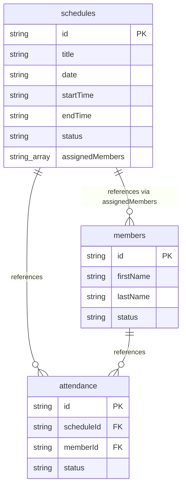

# Phase 4 — Schedule Management: Technical Design (Revised)

This document details the revised technical design for the **Schedule Management** module (Phase 4), updated to simplify the layout, map relations directly inside the schedule document, and enforce conflict-free member assignments.

---

## 1. Firestore Database Schema

We will use a single Firestore collection, `schedules`, storing service metadata and member assignments directly. The separate `scheduleAssignments` collection has been removed.

### `schedules` (Collection)
Each document represents a scheduled ministry service.
- **Path:** `/schedules/{scheduleId}`
- **Fields:**
  - `id`: `string` (Firestore auto-generated ID)
  - `title`: `string` (e.g. "Sunday Morning Worship")
  - `date`: `string` (ISO date format: `YYYY-MM-DD`)
  - `startTime`: `string` (24-hour format: `HH:MM`, e.g. `"07:00"`)
  - `endTime`: `string` (24-hour format: `HH:MM`, e.g. `"08:30"`)
  - `status`: `string` (e.g. `"upcoming"`, `"ongoing"`, `"completed"`, `"cancelled"`)
  - `assignedMembers`: `string[]` (Array of Firestore member document IDs)
  - `createdAt`: `serverTimestamp()`
  - `updatedAt`: `serverTimestamp()`

---

## 2. TypeScript Interfaces

We will define these interfaces under `src/types/schedule.ts`:

```typescript
export type ScheduleStatus = 'upcoming' | 'ongoing' | 'completed' | 'cancelled'

export interface Schedule {
  id: string
  title: string
  date: string // YYYY-MM-DD
  startTime: string // HH:MM
  endTime: string // HH:MM
  status: ScheduleStatus
  assignedMembers: string[] // Array of member IDs
  createdAt: any
  updatedAt: any
}

export interface ScheduleInput {
  title: string
  date: string
  startTime: string
  endTime: string
  status?: ScheduleStatus // Defaults to calculated status unless cancelled
  assignedMembers?: string[]
}
```

---

## 3. Entity Relationships

The relationships are simplified. The many-to-many relationship is now represented as an array of document IDs inside the `schedules` collection:



---

## 4. Automatic Status Derivation

To make the application dynamic, the status of a schedule will be computed automatically on retrieval based on current client date and time, unless the status is explicitly set to `"cancelled"`.

### Logic Algorithm:
```typescript
export const getScheduleStatus = (
  schedule: Pick<Schedule, 'date' | 'startTime' | 'endTime' | 'status'>
): ScheduleStatus => {
  if (schedule.status === 'cancelled') {
    return 'cancelled'
  }

  const now = new Date()
  const todayStr = now.toISOString().split('T')[0] // YYYY-MM-DD
  const currentTimeStr = now.toTimeString().split(' ')[0].substring(0, 5) // HH:MM

  if (schedule.date < todayStr) {
    return 'completed'
  } else if (schedule.date > todayStr) {
    return 'upcoming'
  } else {
    // Dates are equal, check time ranges
    if (currentTimeStr < schedule.startTime) {
      return 'upcoming'
    } else if (currentTimeStr >= schedule.startTime && currentTimeStr <= schedule.endTime) {
      return 'ongoing'
    } else {
      return 'completed'
    }
  }
}
```

> [!NOTE]
> **Midnight Crossing Limitation:**
> Version 1 time comparison checks assume same-day boundaries. Services crossing midnight (e.g. starting at `23:00` and ending at `01:00` on the following day) are not supported. All services must start and end on the same calendar date.

---

## 5. CRUD & Assignment Workflow

### Create Schedule
- Admin inputs Title, Date, `startTime`, and `endTime`.
- Service initializes `assignedMembers` as an empty array `[]` and persists the document using an auto-generated ID.

### Update Schedule
- Admin edits service fields. `updatedAt` is updated with `serverTimestamp()`.

### Delete Schedule
- Verify against `/attendance` collection: If attendance records already exist referencing this `scheduleId`, deletion is blocked to protect historical report summaries.
- If allowed, the schedule document is deleted.

### Member Assignment
- Admin views a service card and selects **Assign Members**.
- The modal lists active members (`status == 'active'`).
- The admin toggles checkboxes, updating the list.
- Click **Save** writes the updated member ID array (`assignedMembers`) directly to the schedule document under a single `updateDoc` operation, after running **Overlap Validation** in the service layer.

---

## 6. Overlapping Schedule Validation

To ensure members are not double-booked, we enforce the following validation rule:
> **Rule:** "A member cannot be assigned to overlapping schedules on the same date unless one of the schedules is cancelled."

### Logic Implementation (Service Layer):
For each member `memberId` being assigned to a schedule `S` (date, startTime, endTime):
1. Query all existing schedules in Firestore where:
   - `date == S.date`
   - `status != 'cancelled'`
   - `assignedMembers` contains `memberId`
   - `id != S.id` (exclude the schedule being edited)
2. Iterate through matched schedules. For each schedule `A`, check if they overlap using the formula:
   ```typescript
   const isOverlapping = S.startTime < A.endTime && A.startTime < S.endTime
   ```
3. If `isOverlapping` is true for any schedule, throw a validation error detailing the schedule title and time conflict.

> [!NOTE]
> **Midnight Crossing Limitation:**
> Version 1 overlap check assumes same-day boundaries. Overlaps crossing midnight (e.g., comparing a schedule from `23:00` to `00:30` on next day) are not supported.

---

## 7. Attendance Integration

- **Normalized Schema:** Attendance documents will reference only `scheduleId` and `memberId` keys.
- **No Data Duplication:** Member names or schedule descriptions are **never** stored inside the attendance collection. All UI tables and reports will resolve member names dynamically using member records lookup.
- **Archived Members Constraint:** Archived members cannot be newly assigned to schedules. However, past schedules containing their IDs in `assignedMembers` remain intact, preserving historical attendance records.

---

## 8. UI/UX Layout Proposal

- **Schedules Page (`src/features/schedules/pages/SchedulesPage.tsx`):**
  - Displays list of upcoming and completed schedules in chronologically sorted blocks.
  - Features filters by Date Range and computed Status.
- **Schedule Card Component (`src/features/schedules/components/ScheduleCard.tsx`):**
  - Displays title, date, `startTime` to `endTime` span, and computed status badge (`upcoming`, `ongoing`, `completed`, `cancelled`).
  - Action buttons:
    - **Manage Assignments:** Opens the checklist modal.
    - **Take Attendance:** Navigates to `/attendance?scheduleId=id`.
    - **Edit/Delete:** Standard modal access.

---

## 9. Firestore Query Strategy

1. **Schedules Retrieval:**
   Query `/schedules` sorted by `date` (asc) and `startTime` (asc).
2. **Members Selection List:**
   Query `/members` where `status == 'active'` sorted by `lastName` and `firstName` to build the checkboxes checklist.

---

## 10. Validation Rules

- **Time Constraints:**
  - `startTime` must be chronologically before `endTime` (e.g. `"07:00"` < `"08:30"`).
- **Date Check:**
  - Deleting/Editing date of completed schedules displays a warning to ensure attendance records are not orphaned.
- **Assignment Validation:**
  - Checks that every member in `assignedMembers` has `status == 'active'` before saving.
  - Checks for overlapping schedule assignments on the same date (throws error to UI).
